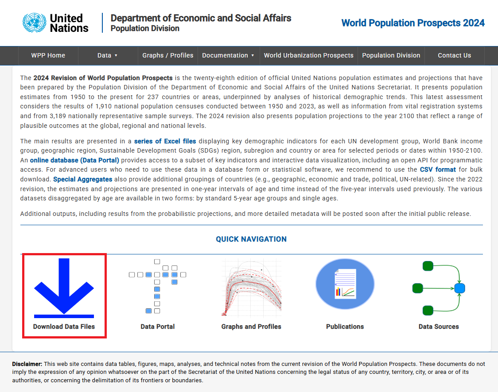
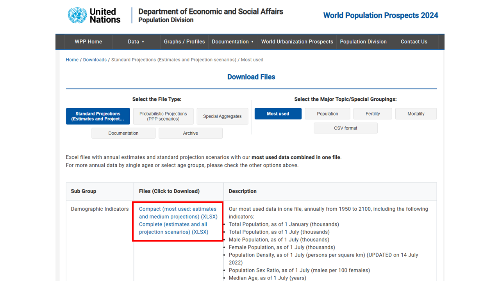

## 개요 {.unnumbered}

여기서는 R로 데이터사이언스를 하는 과정 중 데이터 불러오기(importing)에 집중한다. 데이터 불러오기란 데이터를 가져와 R 객체로 만드는 것을 말한다. 본격적으로 해당 주제를 다루기 전에 [**tidyverse**](https://www.tidyverse.org/)의 공식 데이터 프레임 형식인 티블(tibble)에 대해 간단히 설명한다.

우선 [**tidyverse**](https://www.tidyverse.org/) 패키지를 불러온다.

```{r}
library(tidyverse)
```

## 티블(tibble)

### 왜 티블인가?

데이터 프레임은 가장 널리 사용되는 데이터 형식이고, 일반적인 상황이라면 거의 대부분 데이터 프레임을 가지고 데이터사이언스를 한다. Base R은 전통적으로 `data.frame` 객체를 통해 데이터 프레임을 관리해왔다. `tibble`은 이러한 `data.frame`의 현대적 개량 버전으로 이해하면 되고, 조금의 차이는 있지만 대동소이하다. 이 새로운 데이터 프레임 형식은 `tidyverse` 패키지의 핵심 패키지 중 하나인 [**tibble**](https://tibble.tidyverse.org/) 패키지에서 지원된다.

### 티블 컬럼 유형

한 개의 원소 이상의 어레이를 벡터라고 한다. 여기서 각 벡터가 가진 데이터의 성격을 벡터 유형(type)이라고 하고, 컬럼 유형(type) 혹은 데이터 유형이라고도 한다. 앞에서 살펴본 것처럼, 벡터는 숫자형일 수도 있고, 문자형일 수도 있다. 그러나 이러한 컬럼 유형은 훨씬 다양할 수 있다. 여기서는 [**tibble**](https://tibble.tidyverse.org/) 패키지가 규정하는 컬럼 유형에 대해 살펴본다. 자세한 내용은 [여기](https://tibble.tidyverse.org/articles/types.html)를 참조할 수 있다.

| 클래스 | 데이터 유형 | 예시 | 기호 |
|------------------|------------------|------------------|------------------|
| 원자(atomic) 벡터 | 논리형(logical) | `TRUE` | lgl |
|  | 정수형(integer) | `1L` | int |
|  | 실수형(double) | `1.5` | dbl |
|  | 문자형(character) | `"A"` | chr |
|  | 복소수형(complex) | `0+1i` | cpl |
|  | 원시형(raw) | `as.raw(1)` | raw |
| 리스트(list) 벡터 | 리스트(list) | `list(1)` | list |
|  | 명명 리스트(named list) | `list(a = 1)` | named list |
| 빌트인 객체 | 범주형(factor) | `factor("A")` | fct |
|  | 순서형(ordered) | `ordered("a")` | ord |
|  | 날짜형(Date) | `Sys.Date()` | date |
|  | 날짜시간형(POSIXt) | `Sys.time()` | dttm |
|  | 시간차이형(difftime) | `vctrs::new_duration(1)` | drtn |
| 데이터 프레임 | 데이터 프레임(data.frame) | `data.frame(a = 1)` | df\[,1\] |
|  | 티블(tbl_df) | `tibble(a = 1)` | tibble\[,1\] |

### 티블 생성하기

#### 기존 데이터를 티블 포맷으로 변환하기

Base R에 포함되어 있는 `iris`라는 데이터 프레임을 사용한다. 이 데이터는 `iris`라는 꽃 50개의 관찰값이다. 아래의 코드를 실행하면 `iris` 데이터가 `data.frame` 형식으로 저장되어 있음을 알 수 있다. Base R의 `class()` 함수의 쓰임새를 확인하라.

```{r}
iris |> 
  glimpse()  
class(iris)
```

`as_tibble()` 함수를 이용하여 `tibble` 객체로 전환한다. 그러면 `data.frame` 객체가 `tibble` 객체로 전환된 것을 알 수 있다. 결과에 `data.frame`이 함께 표시되는 이유는 `tibble`이 `data.frame`의 하위 클래스이기 때문이다.

```{r}
iris_tbl <- iris |> 
  as_tibble() 
class(iris_tbl)
```

아래와 같이 데이터를 열어보면, `data.frame` 객체에서는 볼 수 없는 정보가 나타난다.

```{r}
iris_tbl
```

행이 150개이고 열이 5개라는 사실이 가장 위에 나타나 있고, 앞의 네개 컬럼의 데이터 유형은 실수형(dbl)이고 마지막 컬럼은 범주형(fct)라는 것을 알 수 있다.

#### 티블 객체를 직접 생성하기

`tibble` 객체를 직접 생성하는 방식은 두 가지로 나뉜다.

-   열-단위 방식(보다 일반적): 우선 열-벡터를 만들고 그것을 결합해 최종적인 `tibble` 객체를 만든다. `tibble()` 함수를 이용한다.

-   행-단위 방식: 우선 행-벡터를 만들고 그것을 결합해 최종적인 `tibble` 객체를 만든다. `tribble()` 함수를 이용한다. `tribble`은 전치티블(**tr**ansposed t**ibble**)의 약자이다.

```{r}
tibble(
  x = c(1, 2, 5), 
  y = c("l", "k", "p"),
  z = c(0.08, 0.83, 0.60)
)
```

```{r}
tribble(
  ~x, ~y, ~z,
  1, "l", 0.08,
  2, "k", 0.83,
  5, "p", 0.60
)
```

::: {.callout-note collapse="true" title="열-단위와 행-단위"}
```{r}
tibble(
  number = c(1, 2, 3), 
  name = c("seowoo", "wuhyung", "sang-ill"),
  score = c(70, 83, 79)
)
```

```{r}
tribble(
  ~number, ~name, ~score,
  1, "seowoo", 70,
  2, "wuhyung", 83,
  3, "sang-ill", 79
)
```
:::

### 유용한 티블 함수

#### 행이름 관련 함수

행이름(row name)은 개별 행에 고유한 이름이 부여된 것으로, Base R의 `data.frame` 객체는 행이름으로 `row.names`라는 속성을 갖는다. 비롯 이것이 속성이긴 하지만 다른 컬럼 속성과는 구별되며 하나의 숨겨진 속성처럼 취급된다. 그런데 [**tibble**](https://tibble.tidyverse.org/) 패키지는 행이름 지정을 권장하지 않고, 행이름을 지정하는 간단한 함수도 제공하지 않는다. 타이디버스 철학은 행이름을 숨겨진 속성처럼 취급하기 보다는 하나의 명시적인 컬럼으로 취급하는 것이 더 낳다는 관점에 기반한다. 그러나 [**tibble**](https://tibble.tidyverse.org/) 패키지는 `row.names`를 가진 `data.frame` 객체에 적용할 수 있는 몇 가지 행이름 관련 함수를 제공한다.

위에서와 동일하게 단순한 티블 객체를 생성한다.

```{r}
tbl_1 <- tibble(
  x = c(1, 2, 5), 
  y = c("l", "k", "s"),
  z = c(0.08, 0.83, 0.60)
)
```

행이름(row.name)를 지정한다. `tibble` 객체를 `data.frame` 객체로 전환해 베이스 R의 함수인 `row.names()`를 이용해 행이름을 지정한다.

```{r}
df_1 <- as.data.frame(tbl_1)
row.names(df_1) <- c("A", "B", "C")
df_1
```

`remove_rownames()` 함수를 이용해 행이름을 제거할 수 있다.

```{r}
df_1 |> remove_rownames()
```

`rownames_to_column()` 함수를 이용해 행이름을 또 다른 컬럼으로 전환할 수 있다.

```{r}
df_1 |> rownames_to_column("name")
```

`column_to_rownames()` 함수를 이용해 특정 컬럼을 행이름으로 전환할 수 있다.

```{r}
df_1 |> rownames_to_column("name") |> 
  column_to_rownames("name")
```

#### 행 혹은 열 삽입 함수

다음과 같이 한 행을 삽입한다.

```{r}
tbl_1 |> add_row(x = 10, y = "u", z = 0.75)
```

다음과 같은 방식으로 여러 행을 삽입할 수 있다.

```{r}
tbl_1 |> 
  add_row(x = c(10, 15), y = c("u", "x"), z = c(0.75, 1.10))
```

다음과 같이 한 열을 삽입한다.

```{r}
tbl_1 |> add_column(p = c("TRUE", "TRUE", "FALSE"))
```

다음과 같은 방식으로 여러 열을 삽입할 수 있다.

```{r}
tbl_1 |> 
  add_column(p = c("TRUE", "TRUE", "FALSE"), q = c(1L, 2L, 3L))
```

## 데이터 불러오기

### **readr** 패키지

```{r}
library(readr)
```

#### 파일 형식

[**readr**](https://readr.tidyverse.org/) 패키지는 다양한 함수를 이용해 다양한 형식의 데이터를 불러올 수 있게 도와준다.

-   `read_csv()`: 콤마분리(comma-separated values, CSV) 형식의 파일

-   `read_csv2()`: 세미콜론분리(semicolon-separated) 형식의 파일

-   `read_tsv()`: 탭구분(tab-delimited) 형식의 파일

-   `read_delim()`: 여타의 구분 형식의 파일

-   `read_fwf()`: 고정폭(fixed-width) 형식의 파일

-   `read_table()`: 공백구분 형식의 파일

-   `read_log()`: 아파치 형식(Apache-style)의 로그 파일

#### 컬럼 파싱 함수들

컬럼의 내용 중 특정한 유형의 정보만 추출하는 것을 파싱(parsing)이라고 한다. 이러한 파싱은 새로운 데이터를 읽어들이는 과정에서 파싱을 하는 경우와 기존의 벡터에서 특정 유형을 값을 추출하기 위해 파싱하는 경우의 두 가지로 나뉠 수 있는데, 데이터 유형별로 쌍둥이 함수가 존재한다.

| 데이터 유형       | 새로운 벡터 불러들이기 | 기존 벡터에 적용하기 |
|-------------------|------------------------|----------------------|
| 논리형(logical)   | `col_logical()`        | `parse_logical()`    |
| 정수형(integer)   | `col_integer()`        | `parse_integer()`    |
| 실수형(double)    | `col_double()`         | `parse_double()`     |
| 문자형(character) | `col_character()`      | `parse_character()`  |
| 일시형(datetime)  | `col_datetime()`       | `parse_datetime()`   |
| 날짜형(date)      | `col_date()`           | `parse_date()`       |
| 시간형(time)      | `col_time()`           | `parse_time()`       |
| 범주형(factor)    | `col_factor()`         | `parse_factor()`     |
| 추측형(guess)     | `col_guess()`          | `parse_guess()`      |
| 수치형(number)    | `col_number()`         | `parse_number()`     |

새로운 벡터를 위한 파싱은 데이터를 불러들이는 과정에서 컬럼 별로 미리 데이터 유형을 지정하면 여러가지로 이점이 있기 때문에 중요하다. 간단한 사례를 살펴보자.

```{r}
read_csv("
  logical,numeric,date,string
  TRUE,1,2021-01-15,abc
  false,4.5,2021-02-15,def
  T,Inf,2021-02-16,ghi
")
```

위와 같이 데이터가 깔끔하게 주어진다면 데이터를 불러드리는 과정에 개별 컬럼의 유형을 지정할 필요가 없다. 그러나 현실이 이렇게 간단하지 않을 수 있고, 좀 더 복잡한 예제는 다음에서 다루도록 한다.

#### `read_csv()` 함수의 활용

지난번 실습에서 사용한 데이터를 면밀히 살펴본다.

```{r}
students <- read_csv("https://pos.it/r4ds-students-csv")
students
```

다음의 몇 가지 점이 불만족스럽다.

-   변수명: 특히 `Student ID`와 `Full Name` 변수명은 규칙에 어긋난다. 변수명 속에 공란이 있으면 좋지 않다. 이런 이름을 비구문명(non-syntactic name)이라고 하고, 백틱(\` \`)으로 둘러싸여 표시된다. 나중에 문제를 일으킬 수 있다.

-   변수 형식: `mealPlan`은 문자형(chr)이 아니라 팩트형(fct)이며, `AGE`는 문자형(chr)이 아니라 수치형(dbl)이 적절하다.

-   결측치(NA): `favourite.food`의 'N/A'는 형식에 맞지 않아 결측치가 아니라 문자로 취급된다. 따라서 'N/A'가 결측치임을 알려주어야 한다.

이러한 점을 반영하여 csv 파일을 다시 불러오기한다. 여기서 여러 인수의 기능을 이해하는 것이 중요하다. `skip` 인수는 몇번 째 행까지를 읽지 않을 것인가를 지정한다. `col_names` 인수는 컬럼 이름을 지정한다. `col_types` 인수는 컬럼의 유형을 미리 설정하는데, 여기에 위에서 언급한 파싱 함수가 사용된다. `na` 인수는 어떤 셀 값(여기서는 "N/A")을 결측치(NA)로 취급할 것인가를 지정한다.

```{r}
students <- read_csv(
  "https://pos.it/r4ds-students-csv", 
  skip = 1, 
  col_names = c("student_id", "full_name", "favorite_food", "meal_plan", "age"),
  col_types = cols(
    meal_plan = col_factor(),
    age = col_number()),
  na = c("N/A")
  )
students
```

### 엑셀 파일

#### readxl 패키지

가장 널리 사용되는 스프레드시트(spreadsheet) 형식인 엑셀 파일을 불러들이기 위해서는 [**readxl**](https://readxl.tidyverse.org/)이라는 패키지가 필요하다. [**tidyverse**](https://www.tidyverse.org/)의 핵심 패키지는 아니지만 일종의 친척 패키지라 할 수는 있다. [**tidyverse**](https://www.tidyverse.org/)에 포함되어 있지 않기 때문에 따로 인스톨하고 `library()` 함수를 통해 불러와야 한다.

```{r}
library(readxl)
```

가장 널리 사용되는 명령어는 다음의 세 가지이다.

-   `read_xls()`: xls 확장자를 가진 엑셀 파일 불러오기

-   `read_xlsx()`: xlsx 확장자를 가진 엑셀 파일 불러오기

-   `read_excel()`: xls 혹은 xlsx 확장자를 가진 엑셀 파일 불러오기

#### `read_excel()` 함수의 활용

`World Population Prospects 2024` 데이터를 직접 다운받아 실습을 진행하고자 한다. 이 데이터셋은 매우 중요하다. 다음의 절차에 따라 해당 엑셀 파일을 다운로드한다.

-   WPP 웹사이트(<https://population.un.org/wpp/>)에 접속한다.

-   Download Data Files를 클릭한다.

{#fig-wpp-1 fig-align="center"}

-   다음의 파일을 클릭한다: Compact (most used: estimates and medium projections) (XLSX)

{#fig-wpp-2 fig-align="center"}

-   엑셀 파일(WPP2024_GEN_F01_DEMOGRAPHIC_INDICATORS_COMPACT.xlsx)을 다운로드하여 자신의 프로젝트 폴더에 저장한다.

R 바깥에서 다운로드한 파일을 열어 어떠한 정보가 어떠한 방식으로 수록되어 있는지 살펴본다. 데이터 불러오기를 위해 다음의 네 가지 사항에 유의해야 함을 이해한다.

-   16번 행까지는 불필요한 영역이다.

-   17번 행을 변수명으로 사용할 경우 많은 문제점이 발생한다.

-   결측치는 공란이거나 '...' 기호로 표시되어 있다.

-   첫 번째 워킹시트(Estimates)에는 1950\~2023의 데이터가, 두 번째 워킹시트(Medium variant)에는 2024\~2100년의 데이터가 수록되어 있다. 나중에 결합해야한다.

우선 엑셀 파일을 그대로 불러와 본다.

```{r}
read_excel(
  "WPP2024_GEN_F01_DEMOGRAPHIC_INDICATORS_COMPACT.xlsx", 
  sheet = "Estimates" 
  )
```

끔찍하다. 위의 네 가지 사항을 감안하여 다음과 같은 코드를 실행한다.

```{r}

new_names <- c("index", "variant", "region_name", "notes", "location_code", 
               "ISO3", "ISO2", "SDMX", "type", "parent_code", "year", "pop_jan_total", 
               "pop_jul_total", "pop_jul_total_male", "pop_jul_total_female", "pop_den", "sex_ratio", 
               "median_age", "natural_change", "RNC", "pop_change", "PGR", 
               "doubling_time", "births", "births_by_f1519", "CBR", "TFR", "NRR", 
               "mean_age_childbearing", "sex_ratio_birth", "deaths_total", 
               "deaths_male", "deaths_female", "CDR", "life_exp_total", 
               "life_exp_male", "life_exp_female", "life_exp_15_total", 
               "life_exp_15_male", "life_exp_15_female", "life_exp_65_total", 
               "life_exp_65_male", "life_exp_65_female", "life_exp_80_total", 
               "life_exp_80_male", "life_exp_80_female", "infant_deaths", 
               "IMR", "live_births", "under_five_deaths", "mort_under_five", 
               "mort_bf_40_total", "mort_bf_40_male", "mort_bf_40_female", "mort_bf_60_total", 
               "mort_bf_60_male", "mort_bf_60_female", "mort_bt_1550_total", 
               "mort_bt_1550_male", "mort_bt_1550_female", "mort_bt_1560_total", 
               "mort_bt_1560_male", "mort_bt_1560_female", "net_migrants", "NMR")

wpp_2024_estimates <- read_excel(
  "WPP2024_GEN_F01_DEMOGRAPHIC_INDICATORS_COMPACT.xlsx",
  sheet = "Estimates",
  skip = 17, 
  col_names = new_names,
  col_types = c(rep("guess", 3), "text", "guess", rep("text", 2), rep("guess", 58)),
  na = c("...", "")
)

wpp_2024_future <- read_excel(
  "WPP2024_GEN_F01_DEMOGRAPHIC_INDICATORS_COMPACT.xlsx",
  sheet = "Medium variant",
  skip = 17, 
  col_names = new_names,
  col_types = c(rep("guess", 3), "text", "guess", rep("text", 2), rep("guess", 58)),
  na = c("...", "")
)

wpp_2024 <- bind_rows(wpp_2024_estimates, wpp_2024_future)

wpp_2024 <- wpp_2024 |> 
  filter(
    type != "Label/Separator"
  ) |> 
  mutate(
    across(
      c(pop_jan_total, pop_jul_total, pop_jul_total_male, pop_jul_total_female, 
        natural_change, pop_change, births, deaths_total, 
        deaths_male, deaths_female, net_migrants), \(x) x * 1000
    )
  )

view(wpp_2024)
```

위의 코드는 다음의 단계로 진행된 것이다.

-   변수명을 새로 지정해 둔다.

-   `read_excel()` 함수를 이용하여 시트명이 "Estimates"(1950-2023)인 것을 불러들인다. `sheet`, `skip`, `col_names`, `col_types`, `na`과 같은 인수가 사용된다. `sheet` 인수는 엑셀 시트의 이름을 지정하고, `skip` 인수는 몇번 째 행까지를 읽지 않을 것인가를 지정한다. `col_names` 인수는 컬럼 이름을 지정하는데, 미리 만들어 둔 `new_names` 객체가 지정된 것을 볼 수 있다. `col_types` 인수는 컬럼의 유형을 미리 설정하는데, "skip", "guess", "logical", "numeric", "date", "text", "list" 중 선택을 할 수 있다. 불러들인 후 다시 지정할 수도 있지만 미리 해두면 불러 들이는 시간을 좀 더 단축할 수 있다.

-   동일한 방식으로 시트명이 "Medium variant"(2024-2100)인 것을 불러들인다. 동일한 인수가 사용된다.

-   `bind_rows()` 함수를 이용하여 두 객체를 결합한다.

-   불필요한 행(`type` 컬럼이 "Label/Separator"로 되어 있는 경우)을 제거하고, 단위가 1,000으로 설정되어 있는 변수들을 원 변수값으로 되돌린다.

나중에 사용하기 위해, [**writexl**](https://github.com/ropensci/writexl) 패키지의 `write_xlsx()` 함수를 이용하여 엑셀 파일로 저장한다.

```{r}
library(writexl)
write_xlsx(wpp_2024, "wpp_2024.xlsx")
```

그런데, 저장된 파일을 `read_excel()` 함수로 다시 불러 들이면 컬럼 형식에 대한 정보가 사라져 버리는 등의 에러가 발생한다. 이런 점 때문에 다음과 같은 대안이 존재한다. [**readr**](https://readr.tidyverse.org/) 패키지의 `write_rds()` 함수로 저장하고, 다시 `read_rds()` 함수로 불러들이면 정확히 동일한 것을 얻을 수 있다. RDS는 R에서만 사용되는 데이터 이진 포맷(binary format)이다.

```{r}
write_rds(wpp_2024, "wpp_2024.rds")
read_rds("wpp_2024.rds")
```

### 데이터 쓰기

**readr** 패키지는 `write_csv()`, `write_delim()`와 같은 함수를 제공한다. 엑셀 파일을 저장하기 위해서는 [**writexl**](https://github.com/ropensci/writexl) 패키지의 `write_xlsx()` 함수를 사용한다. 혹은 [**openxlsx**](https://ycphs.github.io/openxlsx/) 패키지의 `write.xlsx()` 함수를 사용할 수도 있다.

:::: {.callout-note collapse="false" title="엑셀 데이터 정돈해보기"}
[문제 데이터셋 다운](students_raw.xlsx)

::: panel-tabset
## 문제

학생들의 정보가 입력된 `students_raw.xlsx`는 원자료로, 바로 분석에 사용하기 적합하지 않다. 위에서 배운 내용을 활용하여 데이터를 불러오고, 정돈하여라.

-   먼저, 다운받은 데이터가 Working Directory에 있는지 확인한다.

-   컬럼의 이름을 보기 좋게 바꾸어라. (`_`이외의 기호가 없도록 해라)

-   변수의 타입을 알맞게 변환해라. (숫자형, 문자형, 논리형)

-   마지막으로 정돈된 데이터셋을 `students_cleam.xlsx`로 저장해 보아라.

## 코드

```{r}

students_clean <- read_excel(
  "students_raw.xlsx",
  skip = 1,
  col_names = c("id","name","enrolled","height","gpa","email"),
  col_types = c("numeric","text","logical",rep("numeric",2), "text")
)

write_xlsx(students_clean, "students_clean.xlsx")

```
:::
::::
