# [도입]{style="color:coral"}

## 

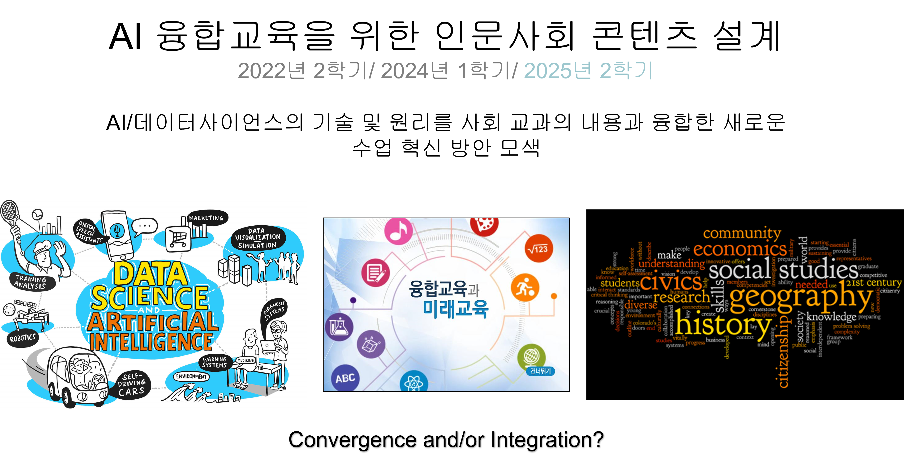

## 

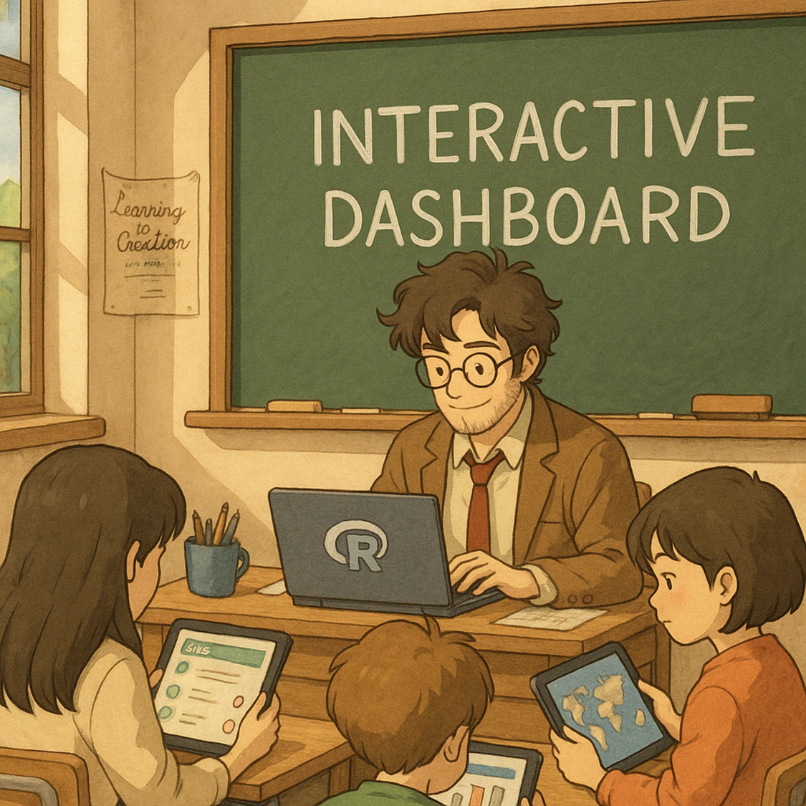{fig-align="center" height="950px"}

## 

::: {layout="[40,60]"}
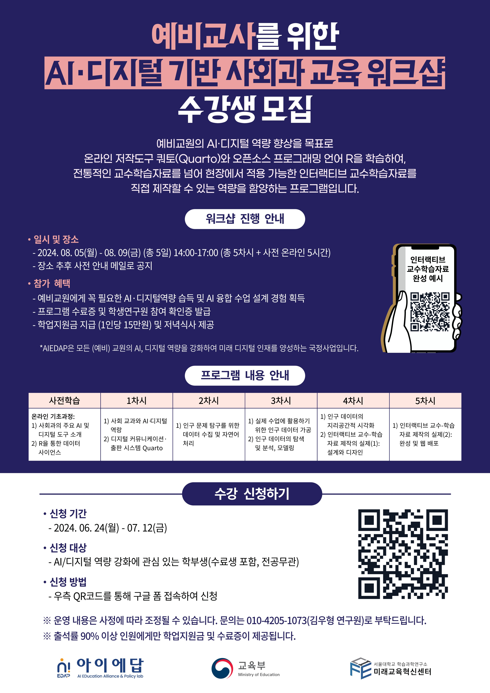


:::

## 

{style="font-size:1rem"}](images/clipboard-4164862292.png)

## 

.JPG)

## 

{style="font-size:1rem"}](images/clipboard-3107289254.png){.center}

## 

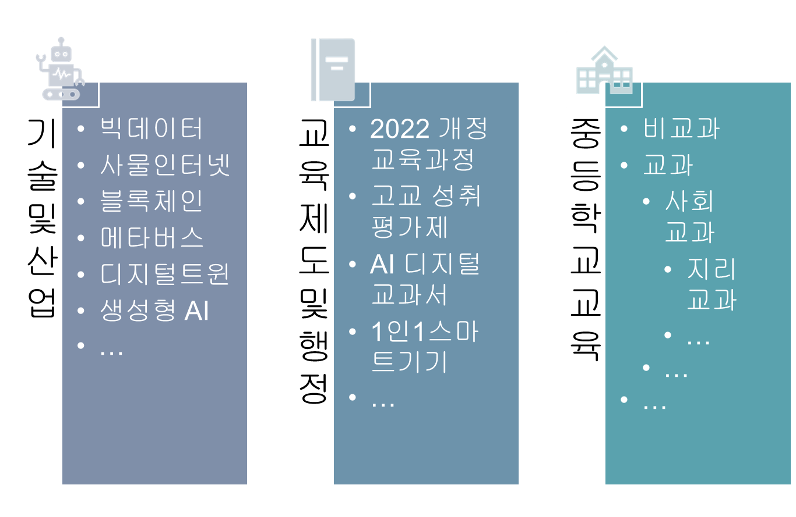

## 

::: {style="position: absolute; top: 0%; left: 0%; padding: 10px; border: 1px solid #ccc; border-radius: 8px; background-color: rgba(255, 255, 255, 0.8); display: flex; flex-direction: column; align-items: center; justify-content: center; text-align: center; line-height: 1.2; font-size: 2rem"}
**ChatGPT** <br> by <br> OpenAI <br> (2022.11.30.)
:::

{style="font-size:1rem"}](images/clipboard-2646416712.png)

## 

::: {style="position: absolute; top: 0%; left: 0%; padding: 10px; border: 1px solid #ccc; border-radius: 8px; background-color: rgba(255, 255, 255, 0.8); display: flex; flex-direction: column; align-items: center; justify-content: center; text-align: center; line-height: 1.2; font-size: 2rem"}
**튜링 테스트** <br> by <br> 앨런 튜링 <br> Alan Turing <br> (1949)
:::

{style="font-size:1rem"}](images/clipboard-1016257508.png){fig-align="center"}

## 

{style="font-size:1rem"}](images/clipboard-81184544.png){style="font-size:1.25rem" fig-align="center"}

## 

::: {style="position: absolute; top: 0%; left: 0%; padding: 10px; border: 1px solid #ccc; border-radius: 8px; background-color: rgba(255, 255, 255, 0.8); display: flex; flex-direction: column; align-items: center; justify-content: center; text-align: center; line-height: 1.2; font-size: 2rem"}
**Google DeepMind** <br> vs.Lee Sedol <br> 2016.03.13.
:::

{.center style="position: absolute; top: 50%; left: 50%; transform: translate(-50%, -50%);"}

## 

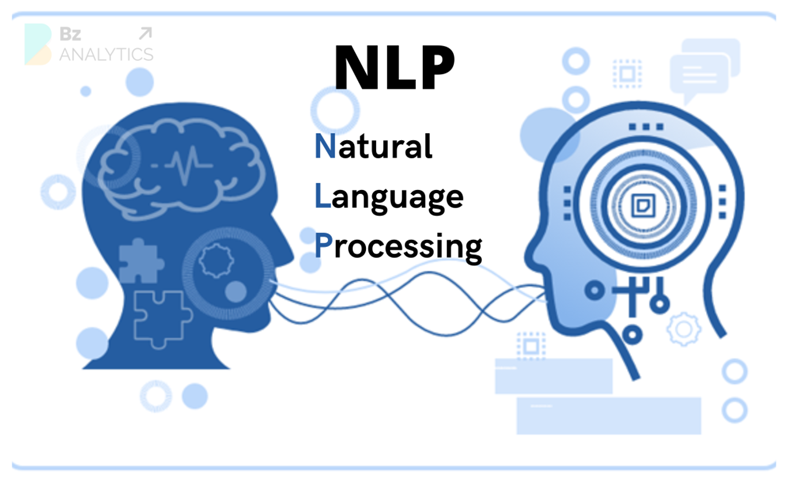{style="position: absolute; top: 0%; left: 0%; font-size: 2rem"}

{style="font-size:1rem"}](images/clipboard-2688393840.png){style="position: absolute; top: 55%; left: 0%;" width="700"}

){style="font-size:1rem"}](images/clipboard-1598365557.png){style="position: absolute; top: 0%; left: 60%;"}

::: {style="position: absolute; top: 0%; left: 55%; padding: 10px; border: 1px solid #ccc; border-radius: 8px; background-color: rgba(255, 255, 255, 0.8); display: flex; flex-direction: column; align-items: center; justify-content: center; text-align: center; line-height: 1.2; font-size: 1.5rem;"}
**트랜스포머(Transformer)** <br> "Attention is All You Need" (2017)
:::

::: {style="position: absolute; top: 80%; left: 40%; padding: 10px; display: flex; flex-direction: column; align-items: center; justify-content: center; text-align: center; line-height: 1.2; font-size: 1.5rem;"}
2013
:::

## 

::: {style="position: absolute; top: 0%; left: 0%; padding: 10px; border: 1px solid #ccc; border-radius: 8px; background-color: rgba(255, 255, 255, 0.8); display: flex; flex-direction: column; align-items: center; justify-content: center; text-align: center; line-height: 1.2; font-size: 2rem"}
**ChatGPT** <br> by <br> OpenAI <br> (2022.11.30.)
:::

{style="font-size:1rem"}](images/clipboard-2646416712.png)

::: {style="position: absolute; top: 0%; left: 73%; display: flex; flex-direction: column; align-items: center; justify-content: center; text-align: center; line-height: 1.2; font-size: 2rem"}
"생성 능력을 가진, 사전학습된, <br> 트랜스포머 구조 기반 언어모델" <br> **G**enerative <br> **P**re-tranind <br> **T**ransformer
:::

## GPT

-   Generative 생성적

    -   입력을 분류 및 분석하는 것이 아니라 새로운 텍스트를 생성할 수 있음

    -   텍스트 뿐만 아니라, 이미지, 음성/오디오, 비디오, 코드, 멀티모달 생성

-   Pre-trained 사전학습된

    -   방대한 범용 텍스트 데이터로 일반 언어 패턴을 미리 학습

    -   문법, 의미, 맥락, 지식 패턴을 학습

-   Transformer 트랜스포머

    -   학습 메커니즘: 딥러닝 신경망 구조

    -   '셀프 어텐션(self attention)'

        -   문장 내 각 요소를 문장 전체 맥락 속에서 재정의

        -   문맥에 맞는 해석 및 문장 내에서 멀리 떨어진 단어 간 관계 포착에 유리

## 

LLM(대규모 언어 모델)

::: {layout-ncol="2"}
{style="font-size:1rem"}](images/clipboard-1021409242.png){style="font-size:3rem"}

{style="font-size:1rem"}](images/clipboard-3341631511.png)
:::

##  {.center}

{style="font-size:1rem"}](images/clipboard-1727070972.png)

## 

::: {layout-ncol="2" layout-valign="center"}
{style="font-size:1rem"}](images/clipboard-1848369011.png)

{style="font-size:1rem"}](images/clipboard-4073771849.png)
:::

## 

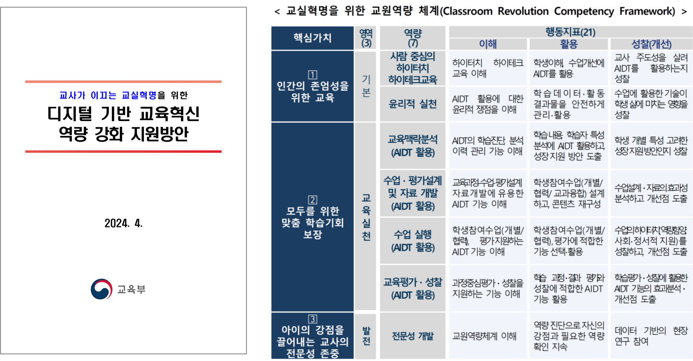

# [TPACK과 AIㆍ디지털 역량]{style="color:coral"}

## 

{style="font-size:1rem"}](images/clipboard-198118978.png){fig-align="center"}

## TPACK: 개념

-   Technological Pedagogical Content Knowledge, 테크놀로지 교수내용지식

    -   Lee Shulman의 교수내용지식(PCK)(1986)

    -   Mishra & Koehler(2006): 교사가 "무엇을, 어떻게, 그리고 어떤 테크놀로지로" 가르칠지를 통합적으로 이해하고 실천하는 프레임워크

-   세 가지 기본 지식 영역

    -   CK(Content Knowledge, 내용지식): 교과 내용에 대한 전문 지식

    -   PK(Pedagogical Knowledge, 교수지식): 교수ㆍ학습 방법에 대한 지식

    -   TK(Techonological Knowledge, 테크놀로지 지식): 다양한 테크놀로지 도구와 시스템에 대한 지식

## TPACK: 개념

-   결합 영역

    -   PCK(Pedagogical Centent Knowledge, 교수내용지식): 특정 내용을 효과적으로 가르치는 방법에 대한 지식

    -   TCK(Technological Content Knowledge, 테크놀로지 내용지식): 특정 기술이 어떤 방식으로 내용 지식으로 표현, 탐구, 적용할 수 있는지에 대한 이해

    -   TPK(Technological Pedagogical Knowledge, 테크놀로지 교수지식): 특정 기술이 교수ㆍ학습을 어떻게 강화 및 변형할 수 있는지에 대한 이해

    -   [TPACK(테크놀로지 교수내용지식)]{style="color:coral"}: 세 가지 요소가 통합된 상태, 특정 내용을 특정 교수법과 특정 기술을 활용해 효과적으로 가르치는 지식

## 

{style="font-size:1rem"}](images/clipboard-198118978.png){fig-align="center"}

## TPACK: 적용

-   PCK(교수내용지식)

    -   여러 나라의 인구 피라미드를 비교하도록 하여, 저출산과 고령화의 다른 원인을 토론하게 하는 수업

-   TCK(테크놀로지 내용지식)

    -   GIS 소프트웨어(QGIS)를 활용하여 TFR을 지도 위에 시각화

-   TPK(테크놀로지 교수지식)

    -   저출산 고령화 문제에 대한 협동학습에서 학생들이 Padlet이나 Google Docs를 활용해 공동으로 답안을 작성하게 함

    -   Google My Maps를 통해 지도를 제작하게 함

-   TPACK(테크놀로지 교수내용지식)

    -   학생들이 전 세계 국가별 TFR을 시각화하고, 토론을 통해 지역적ㆍ세계적 맥락에서 저출산 문제를 분석 및 해결책을 모색하게 하는 프로젝트 수업

## TPACK: 확장

-   AI-TPACK: Nign et al. (2024)

-   TPACK-Uotl: Sifyan et al. (2023)

-   TDL-TPACK: Cui and Zhang (2022)

-   DPACK: Thyssen et al. (2023)

-   AI Literacy TPACK: Ng et al. (2021)

## 

{style="font-size:1rem"}](images/clipboard-1669834467.png){fig-align="center"}

## TPACK-DBL 프레임워크

-   "TPACK은 내용, 교수, 테크놀로지라는 세 핵심 영역을 **초월**하여, 이들의 상호작용 속에서 형성되는 **새로운 형태의 지식**"

    -   통합된 **총체적** 역량

-   **어떻게** TPACK 역량을 **함양**할 있을까?: [**'디자인을 통한 테크놀로지 학습'**]{style="color:coral"}

    -   **‘실제적(authentic) 디자인 활동’**이 실천적 TPACK 발달을 촉진

        -   단순한 이론적 디자인 연습이 아니라 현실의 수업 맥락이나 교육적 요구를 반영하여 무언가를 실제적으로 디자인 및 구현하는 활동

    -   테크놀로지의 **어포던스(affordance)**와 **제약**을 주어진 교과 내용과 교수법, 그리고 현장 맥락과의 끊임없는 상호작용을 통해 이해하게 된다는 것을 의미

## TPACK-DBL 프레임워크

-   **DBL**(design-based learning, 디자인-기반 학습)

    -   **“탐구와 추론의 과정을 바탕으로 혁신적인 산출물, 시스템, 해결책을 생성하는 교육적 접근”**

    -   **PBL**(problem-based learning, 문제-기반 학습)과 유사하지만 **구체적인 디자인 과제**를 수행한다는 점에서 차이

    -   DBL은 교육 대상이 실제 디자인 문제를 해결하는 과정에 참여하여 범위 설정, 생성, 평가, 창출이라는 공학적 인지 과정을 경험하는 동시에 자신의 학습 과정을 성찰하도록 하는 교수법

    -   **디자인 씽킹**(design thinking) 개념과도 직접적인 연관성

-   TPACK-DBL 프레임워크

    -   **TPACK과 DBL을 결합**함으로써 '디자인을 통한 테크놀로지 학습'이 이루어지기 위한 **원리 혹은 절차**를 제시

    -   DBL의 내용 중 TPACK의 발달을 촉진하는 **8대 원리** 제시

## TPACK-DBL 프레임워크

![[(Baran and Uygun, 2016,49)]{style="font-size:1rem"} [https://doi.org/10.14742/ajet.2551](https://doi.org/10.14742/ajet.2551){style="font-size:1rem"}](images/clipboard-3692320336.png){fig-align="center"}

## TPACK-DBL 프레임워크

::: {style="font-size:2rem"}
| 원리 | 내용 |
|--------------------------------|----------------------------------------|
| 브레인스토밍 | 테크놀로지 통합과 관련된 문제의 잠재적 해결 방안을 탐색하고 논의하는 과정 |
| 테크놀로지 통합 산출물 디자인 | 수업안, 학습 자료, 디지털 콘텐츠 등과 같이 TPACK 기반의 구체적 교육 산출물을 설계하는 과정 |
| 디자인 사례 검토 | 학습자가 테크놀로지 통합 학습 시나리오, 교수ㆍ학습 활동, 수업안 등의 사례를 탐색, 분석, 비평하는 과정 |
| 이론적 지식과의 접목 | 자기주도 학습, 협력 학습과 같은 학습 이론 뿐만 아니라 학습 주제와 관련된 원리나 핵심 개념을 고려하는 과정 |
| ICT 도구 탐색 | 학습자가 디자인에 앞서 테크놀로지의 기능, 교수적 어포던스, 활용 조건 등을 심층적으로 탐색하는 과정 |
| 디자인 경험에 대한 성찰 | 학습자가 디자인 과정에서의 어려움, 선택의 이유, 교수적 적합성을 반추하며 자신의 이해를 구조화하고 TPACK 발달 수준을 점검하는 과정 |
| 실제 맥락 속 디자인 적용 | 설계된 자료를 실제 교수 현장에 적용함으로써 실행 가능한 TPACK의 양상을 탐구하고, 맥락적 변인을 분석하는 과정 |
| 디자인 팀 내 협력 | 구성원들이 공동의 테크놀로지 통합 과제를 수행하면서 해결 방안을 함께 모색함으로써 TPACK을 더욱 실천적으로 발전시키는 과정 |

: {tbl-colwidths="\[35, 65\]"}
:::

## 교사의 AIㆍ디지털 역량

-   **교사**는 디지털 교육 콘텐츠의 **주체적 생산자**

-   교사는 단순히 수업에서 활용할 AIㆍ디지털 도구를 배우는데 그치지 않고, 직접 테크놀로지가 통합된 **교육 산출물를 설계 및 구현**할 수 있는 능력 필요

    -   교수ㆍ학습 상황 설계: 특정 교과 내용을 가를칠 때 어떤 AIㆍ디지털 도구를 통합할지 계획

    -   디지털 산출물 제작: 교사가 직접 테크놀로지를 활용해 교육 자료를 제작

    -   동료 협업 및 피드백: 만든 산출물을 다른 교사와 공유하고, 수업 적용 가능성을 논의

-   [**인터랙티브 교수ㆍ학습 웹 앱의 제작 역량**]{style="color:coral"}

## 인터랙티브 교수ㆍ학습 웹 앱: 기본 개념

-   학습자와 콘텐츠 간의 **상호작용**을 중심으로 설계되어, 능동적 참여, 즉각적 피드백, 탐구 활동 등을 개인의 학습 경험을 향상시키는 **교육용 웹 애플리케이션**

-   **웹 브라우저**를 통해 접근하고 사용하는 **교수ㆍ학습** 목적의 애플리케이션

-   성격

    -   **디지털 학습지**: 교과의 학습 내용을 효과적으로 교수ㆍ학습하도록 도와주는 도구

    -   **탐구 학습 도구**: 데이터 탐색을 통해 학습자 스스로 이해, 지식, 통찰을 얻도록 도와주는 도구

## 인터랙티브 교수ㆍ학습 웹 앱: 기본 개념

-   [**데이터 대시보드**]{style="color:coral"}: 단일한 주제에 대한 상호연관된 다양한 데이터 정보를 그래픽 형태로 일관성 있게 제시한 것

    -   **레이아웃** 요소: 대시보드의 기본 구조

        -   카드

        -   페이지, 네비게이션바, 사이드바, 툴바, 탭셋 등

    -   **내용 요소**: 카드를 채우는 콘텐츠

        -   텍스트, 표, 그래프, 동영상, 밸류 박스, 지도, 챗봇(LLM 활용) 등

    -   **작동 요소**: 상호작용성의 형식과 정도

## 

```{=html}
<iframe src="https://ivelasq.github.io/mortgage-dashboard/" loading="lazy" style="width: 100%; height: 900px; border: 0px none;" allow="web-share; clipboard-write"></iframe>
```

[https://ivelasq.github.io/mortgage-dashboard/](https://ivelasq.github.io/mortgage-dashboard/){style="font-size:1rem"}

## 인터랙티브 교수ㆍ학습 웹 앱: 예시

-   <https://sangillee.snu.ac.kr/dashboard_examples/>
-   <https://sangillee.snu.ac.kr/dashboard_popgeo/>

## 제작 도구

{style="font-size:1rem"}](images/clipboard-809913987.png){style="font-size:1rem" fig-align="center"}

## 제작 도구

-   [**R**](https://www.r-project.org/)(혹은 Python): 인터랙티브 콘텐츠 제작

    -   데이터사이언스 프로세스의 실행: [**tidyverse**](https://tidyverse.org/)

    -   인터랙티브 시각화 및 탐색 기능의 구현: 다양한 패키지

-   [**Quarto**](https://quarto.org/)(쿼토): 대시보드 제작 및 프론트앤드 웹 앱 생성

    -   “과학적, 기술적 출판을 위한 위한 오픈소스 시스템”

    -   다양한 형식의 저작물(노트, 연구 논문, 프레젠테이션, 대시보드, 웹사이트, 블로그, 서적 등)을 다양한 디지털 포맷(HTML, PDF, MS Word, ePub 등)으로 출판할 수 있게 해주는 도구

-   [**Shiny**](https://shiny.posit.co/)(샤이니): 서버-기반 웹 앱 개발

    -   UI-Server 이원 구조

    -   반응형 프로그래밍(reactivity)

## 제작 도구

::: {layout-ncol="3" layout-valign="center"}


:::

## R(알)

::: {layout="[48,-4,48]" layout-valign="center"}
{style="font-size:1rem"}](images/R_logo.svg-01.png)

{style="font-size:1rem"}](images/tidyverse_universe.png)
:::

## 제작 도구: R(알)

{style="font-size:1rem"}](images/clipboard-411135231.png){alt="https://r4ds.hadley.nz/intro"}

## 제작 도구: R(알)

{style="font-size:1rem"}](images/data_science_process_packages-03.png){alt="https://r4ds.hadley.nz/intro.html"}

## 제작 도구: Quarto(쿼토)

{style="font-size:1rem"}](images/quarto_illustration_2-01.png)

## 제작 도구: Shiny(샤이니)

```{=html}
<iframe src="https://sangillee.shinyapps.io/AIEDU2025_Example//" loading="lazy" style="width: 100%; height: 900px; border: 0px none;" allow="web-share; clipboard-write"></iframe>
```

# [R 개관]{style="color:coral"}

## R의 탄생: R의 아버지들(1993년)

::: {layout="[25,50,25]" layout-valign="center" style="text-align:center; line-height:1; font-size:3rem"}
](images/clipboard-4103752460.png)

](images/clipboard-3647657155.png)

)](images/clipboard-3701321516.png)
:::

## R의 탄생: 1.0.0버전(2000년)

{style="font-size:1rem"}](images/clipboard-692617930.png){width="1501"}

## Base R: 기초 개념

-   객체(object): R 환경 안에 존재하는, 식별가능하고 조작 가능한 모든 엔터티

    -   데이터 객체: 숫자/문자/논리값, 벡터, 데이터 프레임

    -   비데이터 객체: 함수, 플롯, 모형 등

-   할당(assignment): 데이터와 이름을 연결해 R 환경에 객체를 저장하는 프로그래밍 언어적 동작

    -   특정한 할당 연산자 사용: `<-` 또는 `=`

-   연산자(operator): 하나 이상의 객체(피연산자)에 적용되어, 객체의 상태를 바꾸거나 새로운 값을 만드는 프로그래밍 언어의 기본 요소

-   함수(function): 특정 동작을 수행하는 코드 블록. 인풋을 함수에 적용하면 함수의 고유한 동작을 통해 아웃풋이 산출

## Base R: 연산자 Operators

{style="font-size:1rem"}](images/clipboard-1399978816.png)

## Base R: 할당 연산자

::: {layout-ncol="2"}
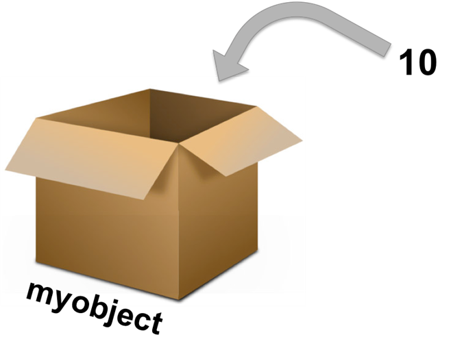

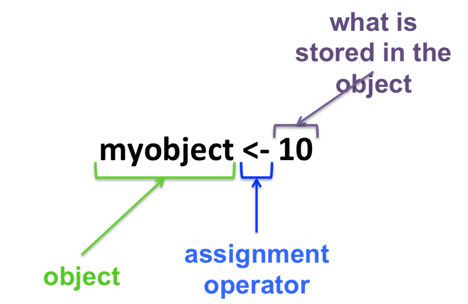
:::

## Base R: 산술 연산자

|   Operator    |   Description    |   Example    |
|:-------------:|:----------------:|:------------:|
|      `+`      |     addition     |   `5+5=10`   |
|      `-`      |   subtraction    |   `5-5=0`    |
|      `*`      |  multiplication  |   `2*8=16`   |
|      `/`      |     division     | `100/10=10`  |
| `^` (or `**`) |  exponent/power  |   `5^2=25`   |
|     `%%`      |      modulo      | `100%%15=10` |
|     `%/%`     | integer division | `100%/%15=6` |

## Base R: 관계, 논리, 기타 연산자 {.scrollable .smaller}

| Type | Operator | Condition |
|----|----|----|
| 관계 Relational | `x < y` | Where `x` less than `y` |
|  | `x > y` | Where `x` greater than `y` |
|  | `x <= y` | Where `x` less than or equal to `y` |
|  | `x >= y` | Where `x` greater than or equal to `y` |
|  | `x == y` | Where `x` (exactly) equals `y` |
|  | `x != y` | Where `x` is not equal to `y` |
| 논리 Logical | `!` | Negation |
|  | `&` | Logical "and" (`x >= 20 & x < 35`) |
|  | `|` | Logical "or (`x == 20 | x > 45`) |
|  | `xor` | Logical "exclusive or" (`xor(x == 20, x == 50`) |
| 기타 Miscellaneous | `x %in% y` | Where `x` is in `y` |
|  | `!x %in% y` | Where `x` is not in `y` |

## Base R: 함수 functions

```{r}
#| echo: true
#| eval: false
seq(from = 2, to = 100, by = 2)
```

{style="font-size:1.25rem"}](images/clipboard-1402738689.png)

## Base R: 주요 산술 함수 {.scrollable .smaller}

| 분류 | 함수 |
|------------------------------------|------------------------------------|
| 절대값/부호 | [`abs()`](https://rdrr.io/r/base/MathFun.html), [`sign()`](https://rdrr.io/r/base/sign.html) |
| 제곱근/지수 | [`sqrt()`](https://rdrr.io/r/base/MathFun.html), [`exp()`](https://rdrr.io/r/base/Log.html) |
| 로그 | [`log()`](https://rdrr.io/r/base/Log.html), [`log10()`](https://rdrr.io/r/base/Log.html), [`log2()`](https://rdrr.io/r/base/Log.html) |
| 삼각함수 | [`sin()`](https://rdrr.io/r/base/Trig.html), [`cos()`](https://rdrr.io/r/base/Trig.html), [`tan()`](https://rdrr.io/r/base/Trig.html), [`asin()`](https://rdrr.io/r/base/Trig.html) |
| 반올림 | [`round()`](https://rdrr.io/r/base/Round.html), [`floor()`](https://rdrr.io/r/base/Round.html), [`ceiling()`](https://rdrr.io/r/base/Round.html), [`trunc()`](https://rdrr.io/r/base/Round.html) |
| 요약 | [`sum()`](https://rdrr.io/r/base/sum.html), [`mean()`](https://rdrr.io/r/base/mean.html), [`median()`](https://rdrr.io/r/stats/median.html), [`var()`](https://rdrr.io/r/stats/cor.html), [`sd()`](https://rdrr.io/r/stats/sd.html), [`min()`](https://rdrr.io/r/base/Extremes.html), [`max()`](https://rdrr.io/r/base/Extremes.html), [`range()`](https://rdrr.io/r/base/range.html), [`summary()`](https://rdrr.io/r/base/summary.html) |

## Base R: 그 외 많이 쓰이는 함수 {.scrollable .smaller}

| 분류           | 함수                                                     |
|--------------------------|----------------------------------------------|
| 논리형 판별    | `is.na()`, `is.numeric()`, `is.character()`, `is.null()` |
| 수열/반복      | `seq()`, `rep()`                                         |
| 난수/표본 생성 | `sample()`, `rnorm()`                                    |
| 유형 변환      | `as.numeric()`, `as.character()`                         |
| 표준화         | `scale()`                                                |
| 길이           | `length()`                                               |
| 정렬           | `sort()`, `order()`                                      |
| 중복 처리      | `unique()`, `duplicated()`                               |

## Base R: 데이터 객체

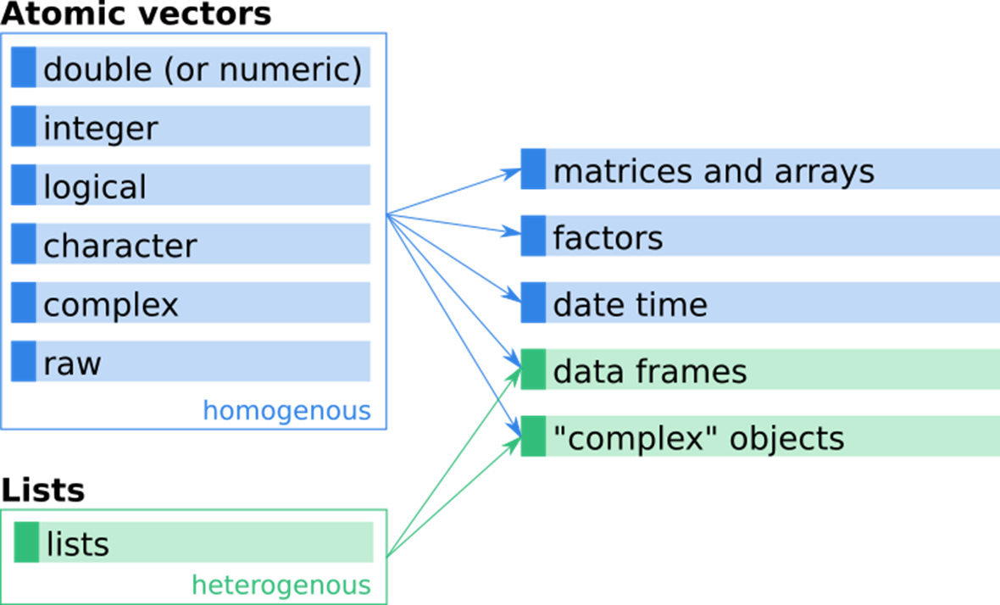{fig-align="center" width="826"}

## Base R: 벡터와 데이터 프레임

::: panel-tabset
## R 코드

```{r}
#| echo: true
a <- c(58, 26, 24, 19)
b <- c(58L, 26L, 24L, 32L)
c <- c(TRUE, TRUE, FALSE, FALSE)
d <- c("이상일", "김우형", "박서우", "이하은")
df <- data.frame(a, b, c, d)
df
```

## webr 연습

```{webr-r}

```
:::

## IDE: RStudio(2011년)

IDE(integrated development environment, 통합개발환경)

::: {layout="[45,-5,55]" layout-valign="center"}


:::

## IDE: RStudio(2011년) {visibility="hidden"}

{style="font-size:1.25rem"}](images/clipboard-1340309066.png)

## IDE: RStudio(2011년)

{style="font-size:1.25rem"}](https://djangostars.com/blog/wp-content/uploads/2022/08/Best-Python-IDE-for-Development_1.2.png){fig-align="center"}

## IDE: RStudio {visibility="hidden"}

{style="font-size:1.25rem"}](https://posit.co/wp-content/uploads/2025/08/FEATURED-BLOG-IMAGE-POSITRON-GTM-BLOG-POST-ANNOUNCEMENT-1.jpg){fig-align="center"}

## IDE: RStudio

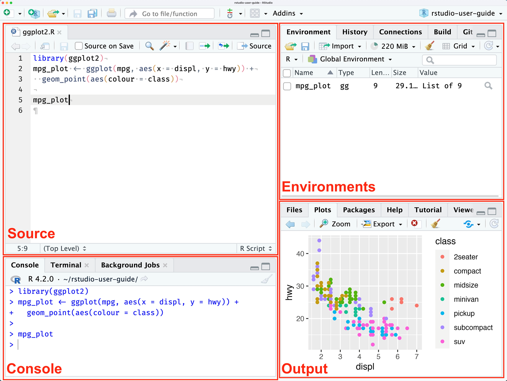{height="900px" fig-align="center"}

## 데이터사이언스와 R: posit(2022년) {visibility="hidden"}

{style="font-size:1rem"}](images/clipboard-4259342209.png)

## 데이터사이언스와 R {visibility="hidden"}

{style="font-size:1rem"}](images/clipboard-4118011220.png){fig-align="center"}

## 데이터사이언스와 R: 혁신가

::: {layout="[55, 45]" style="text-align:center; line-height:1; font-size:3rem"}
{style="font-size:1rem"}](images/clipboard-4118011220.png){height="850px" fig-align="center" height="900"}


:::

## 데이터사이언스와 R: 데이터사이언스 프로세스

{style="font-size:1rem"}](images/clipboard-411135231.png)

## 데이터사이언스와 R: 타이디버스

{style="font-size:1rem"}](images/data_science_process_packages-03.png)

## 데이터사이언스와 R: 타이디버스 {visibility="hidden"}

{style="font-size:1rem"}](images/clipboard-3736095484.png){fig-align="center"}

## 데이터사이언스와 R: 타이디버스

-   "정돈된 데이터(tidy data) 처리와 분석을 위한 하나의 우주적 생태계"

-   데이터사이언스를 일관성 있게 수행하기 위한 패키지들의 패키지

    -   `library(tidyverse)`

::: {layout-ncol="2"}
{style="font-size:1rem"}](images/clipboard-2981827317.png){width="65%"}

{style="font-size:1rem"}](https://sangillee.snu.ac.kr/data_science/images/tidyverse_9.PNG){width="70%"}
:::

## 데이터사이언스와 R: 타이디버스

[타이디 디자인 원리(Tidy Design Principles)](https://design.tidyverse.org/)

-   인간중심성 Human-centeredness

    -   For an end-user programmer

-   일관성 Consistency

    -   The smallest possible set of key ideas, used as comprehensively as possible

-   조합성 Composability

    -   Many simple pieces, composed for a larger task using operators such as \|\> and +

-   포용성 Inclusiveness

    -   Towards a diverse, open, and friendly community

## 데이터사이언스와 R: 파이프 연산자

{fig-align="center"}

## 데이터사이언스와 R: 파이프 연산자

::: panel-tabset
## Base R 1

```{r}
#| eval: false
#| echo: true
ingredients <- tibble(우유, 계란, 밀가루)
mix_result <- mix(ingredients, 강도, 혼합시간, ...)
bake_result <- bake(mix_result, 온도, 굽기시간, ...)
decorate_result <- decorate(bake_result, 장식1, 장식2, ...)
slice_result <- slice(decorate_result, 절단도구, 등분수, ...)
```

## Base R 2

```{r}
#| eval: false
#| echo: true
slice_result <- slice(
  decorate(
    bake(
      mix(
        tibble(
          우유, 계란, 밀가루
        ), 강도, 혼합시간, ...
      ), 온도, 굽기시간, ...
    ), 장식1, 장식2, ... 
  ), 절단도구, 등분수, ...
) 
```

## 파이프 연산자(pipe operator)

```{r}
#| eval: false
#| echo: true
tibble(우유, 계란, 밀가루) |> 
  mix(강도, 혼합시간) |> 
  bake(온도, 굽기시간) |> 
  decorate(장식1, 장식2, ...) |> 
  slice(절단도구, 등분수) -> slice_result
```
:::

## 데이터사이언스와 R: 파이프 연산자

::: {layout-ncol="2" layout-valign="center"}
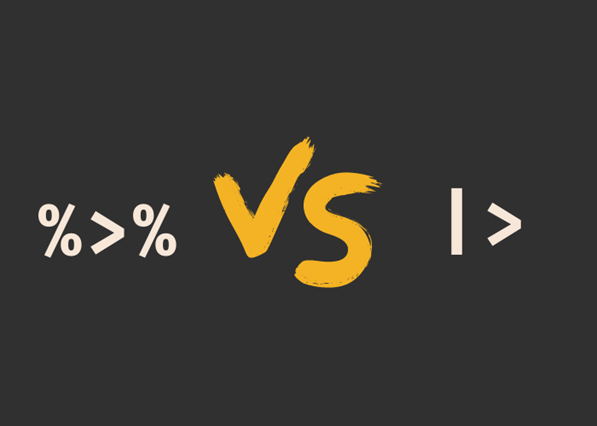

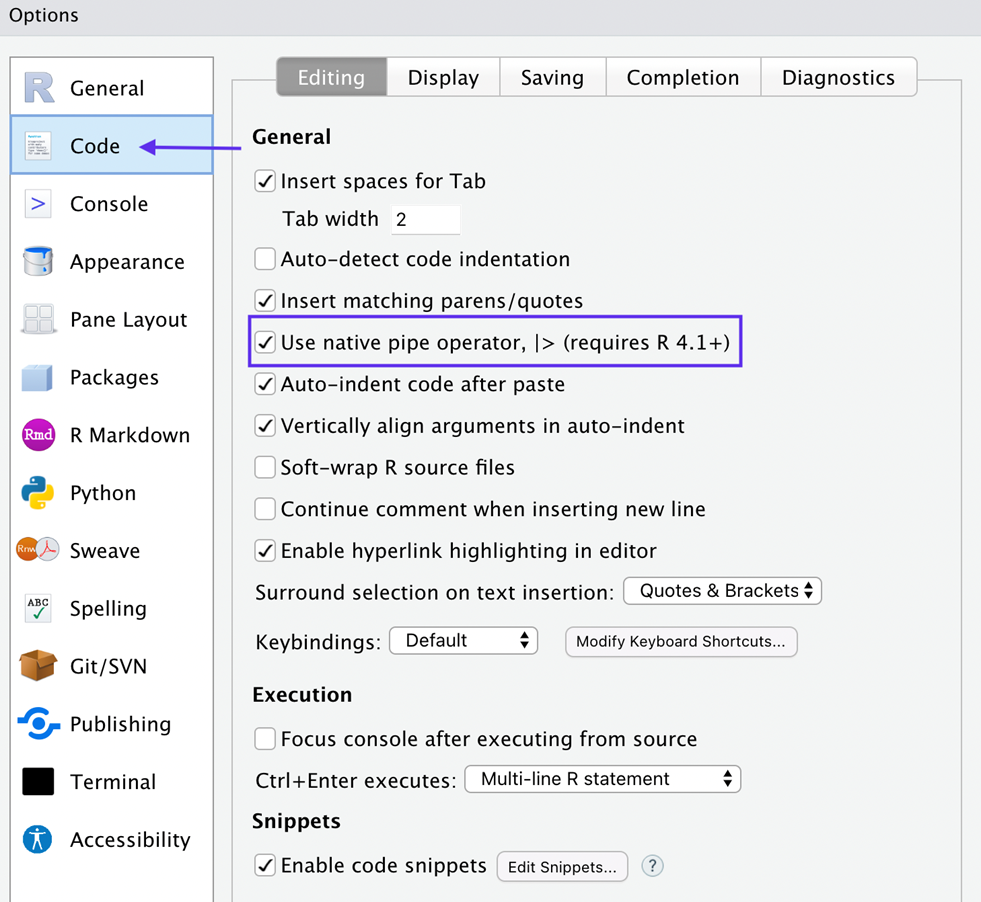
:::

## 데이터사이언스와 R: 파이프 연산자 {visibility="hidden"}

{style="font-size:1rem"}](images/clipboard-174079750.png){fig-align="center"}

## No error, no gain!

{style="font-size:1rem"}](images/clipboard-229605073.png){fig-align="center"}
