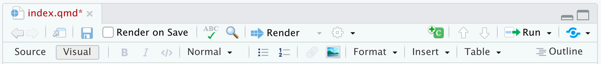
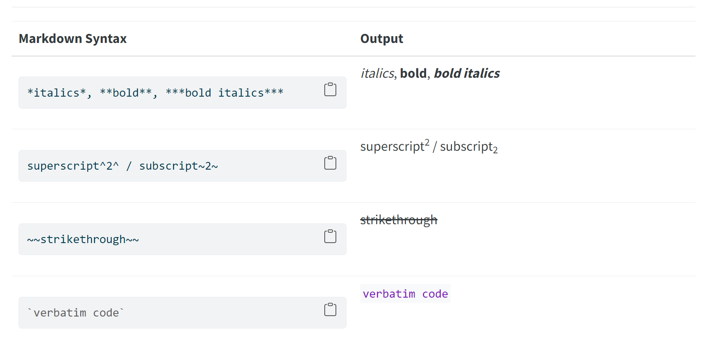
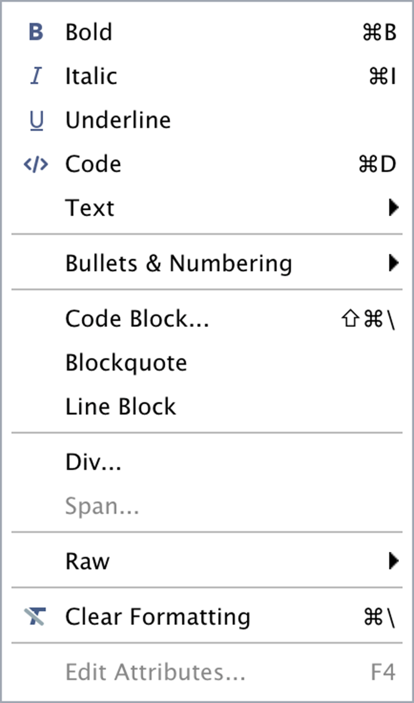
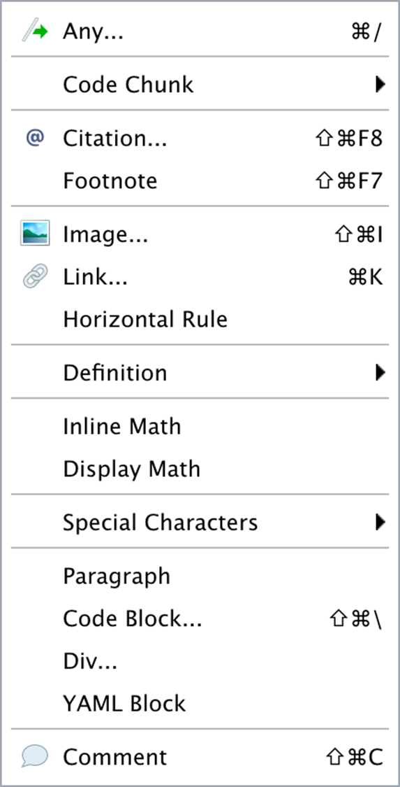
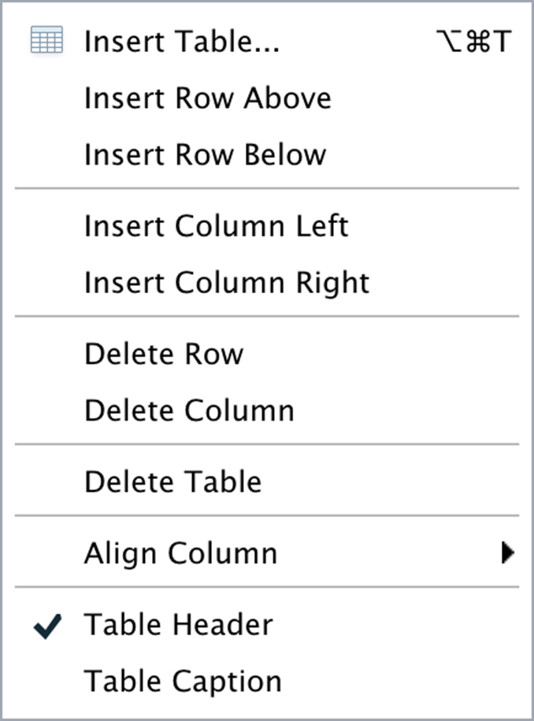

# [Quarto 개요]{style="color:coral"}

## 데이터사이언스 프로세스: 소통

{style="font-size:1rem"}](images/data_science_process_communicate-03.png)

-   소통하기(communicate): 분석 과정과 결과를 대상 청중의 이해 수준과 목적에 맞게 해석ㆍ구성하여, 적절한 형식과 매체를 통해 의미있게 전달하는 과정

## 패키지

{style="font-size:1rem"}](images/data_science_process_packages-02.png)

## 

{style="font-size:1rem"}](images/hex_quarto.png){fig-align="center"}

## 정의

-   "과학적, 기술적 출판을 위한 오픈소스 시스템(an open-source scientific and technical publishing system)"

    -   오픈소스 저작 시스템

-   다양한 형식의 저작물(노트, 연구 논문, 프레젠테이션, 대시보드, 웹사이트, 블로그, 서적 등)을 다양한 디지털 포맷(HTML, PDF, MS Word, ePub 등)으로 출판할 수 있게 해주는 도구

-   적용 분야의 스케일

    -   개인 스케일: 노트, 레포트, 연구 논문, 워크플로, 프레젠테이션, 블로그 등의 작성 도구

    -   그룹 스케일: 프로젝트의 원할한 진행을 위한 협업 프레임워크

    -   사회 스케일: 과학 커뮤니티의 재현성(reproducibility) 고양

## 기능

{style="font-size:1rem"}](images/quarto_illustration_2.png){fig-align="center"}

## 기능

{style="font-size:1rem"}](images/quarto_types.png){fig-align="center"}

## 결과물 예시

-   개인 홈페이지 및 블로그: <https://sangillee.snu.ac.kr/>

-   웹북: <https://r4ds.hadley.nz/>

-   프레젠테이션: [https://sangillee.snu.ac.kr/2025_AI_Edu/Lecture_1_4.html](https://sangillee.snu.ac.kr/2025_AI_Edu/Lecture_1_4.html#/)

-   대시보드: <https://sangillee.snu.ac.kr/dashboard_popgeo/>

-   논문, 포스터, 소식지 등

## 구문(syntax)

-   마크다운(markdown) 언어: 팬독(pandoc)

    -   마크업(markup) 언어: 다큐먼트의 구조와 포맷을 관장하는 텍스트-엔코딩 시스템

    -   사용자의 편의성을 크게 향상시킨 마크업 언어

-   Quarto 다규먼트: `.qmd`

    -   프로그래밍 언어 + 워드프로세서

## 렌더링(rendering)

-   `knitr` 패키지: `.qmd`를 `.md`로 전환

-   `pandoc`: `.md`를 다양한 디지털 포맷으로 전환

{.uri style="font-size:1rem"}](https://quarto.org/docs/get-started/hello/images/rstudio-qmd-how-it-works.png)

## Quarto 다큐먼트 작성

-   File \> New File \> Quarto Document

{style="font-size:1rem"}](https://quarto.org/docs/get-started/authoring/images/rstudio-new-document.png){fig-align="center"}

## Quarto 다큐먼트의 기본 구조

-   YAML(야믈) 헤더(header)

    -   YAML: "YAML Ain't Markup Language"
    -   다큐먼트의 전반적인 사항을 관장하는 메타데이터
    -   시작과 끝에 `---`로 구획 표시
        -   '키(key): 필드(field)'의 형태

-   코드 청크(code chunk)

    -   코드가 들어가는 부분: R 스크립트 파일과 유사
    -   청크 옵션: 청크의 실행ㆍ출력ㆍ표현 방식을 제어하는 메타데이터
        -   `#|`(prefix, 접두 표기)로 시작
        -   '키(key): 필드(field)'의 형태

-   마크다운 텍스트(markdown text)

    -   워드프로세서처럼 텍스트를 작성(표, 그림, 동영상 등 포함)

## Quarto 다큐먼트의 기본 구조

{style="font-size:1rem"}](https://r4ds.hadley.nz/quarto/diamond-sizes-report.png){fig-align="center"}

## YAML 헤더: 옵션 {.smaller}

| 키(key) | 설명 |
|----|----|
| title | 다큐먼트의 제목 |
| date | 다큐먼트 작성 날짜 |
| author | 다큐먼트 저자 이름 |
| format | 다양한 포맷 관련 사항의 지정 |
| toc | 목차 삽입 |
| number-section | 섹션 제목에 자동 번호 부여 여부 |
| execute: echo | 소스 코드의 포함 여부를 글로벌하게 설정, 보통 true |
| execute: warning | 경고 메시지를 산출물에 나타나게 할지를 글로벌하게 설정, 보통 false |
| editor | 비주얼 에디터와 소스 에디터 중 선택, 보통 visual |

## 코드 청크: 옵션 {.smaller}

| Option           | Run code | Show code | Output | Plots | Messages | Warnings |
|------------------|:--------:|:---------:|:------:|:-----:|:--------:|:--------:|
| `eval: false`    |    X     |           |   X    |   X   |    X     |    X     |
| `include: false` |          |     X     |   X    |   X   |    X     |    X     |
| `echo: false`    |          |     X     |        |       |          |          |
| `results: hide`  |          |           |   X    |       |          |          |
| `fig-show: hide` |          |           |        |   X   |          |          |
| `message: false` |          |           |        |       |    X     |          |
| `warning: false` |          |           |        |       |          |    X     |

## 코드 청크: 실행 {.smaller}

{style="font-size:1rem"}](https://quarto.org/docs/get-started/hello/images/rstudio-inline-output.png)

## 마크다운 텍스트

-   소스 에디터(source editor) vs. 비주얼 에디터(visual editor)

-   마크다운 언어의 사용자 편이성을 한 번 더 강화한 것



## 마크다운 텍스트

{style="font-size:1rem"}](https://quarto.org/docs/get-started/hello/images/rstudio-source-visual.png)

## 마크다운 텍스트: 소스 에디터

{fig-align="center"}

## 마크다운 텍스트: 비주얼 에디터

::: {layout-ncol="3"}





:::

## 참고문헌 인용: Zotero

{.uri style="font-size:1rem"}](https://quarto.org/docs/visual-editor/images/visual-editing-citation-search.png){fig-align="center"}

## 웹 발행(publishing)과 호스팅(hosting) 서비스

-   호스팅 서비스

    -   인터넷에 연결된 서버 인프라를 통해 콘텐츠와 애플리케이션을 저장ㆍ실행ㆍ배포할 수 있도록 하는 인프라 제공 서비스

    -   사용자가 자신의 콘텐츠를 로컬 컴퓨터가 아닌 외부 서버에 올려, 언제 어디서나 웹을 통해 접근ㆍ공유할 수 있게 해 주는 서비스

    -   서버 자원 제공, 네트워크 연결, 상시 가동 환경, 운영 및 관리 지원

-   종류

    -   Quarto Pub(<https://quartopub.com/>)

    -   GitHub Pages(<https://pages.github.com/>)

    -   Netlify(<https://www.netlify.com/>)

## Quarto Pub

{.uri style="font-size:1rem"}](https://quarto.org/docs/publishing/images/quarto-pub-default-site.png){fig-align="center"}

# [Quarto로 대시보드 만들기]{style="color:coral"}

## 시작

-   Quarto Dashboard를 위한 프로젝트 만들기

    -   File \> New Project \> ...

-   새 Quarto Document 열기

    -   File \> New File \> Quarto Ducument

-   YAML 헤더

    -   `format: dashborad` 지정

## 요소

-   레이아웃 요소: 대시보드의 기본 구조

    -   카드(행과 열)

    -   페이지, 내비게이션 바, 사이드바, 툴바, 탭셋 등

-   내용 요소: 카드를 채우는 콘텐츠 유형

    -   텍스트, 표, 그래프, 동영상, 밸류박스, 지도, 챗봇(LLM 활용) 등

-   작동 요소: 상호작용성의 형식과 정도

## 예시

<https://sangillee.quarto.pub/my-first-dashboard/>

## 레이아웃 요소 1: 카드

::: panel-tabset
## Code

```         
## Row {height=70%}

Card 1

## Row {height=30%}

### Column {width=40%}

Card 2-1 

### Column {width=60%}

Card 2-2 
```

## Result

{fig-align="center" width="729"}
:::

## 레이아웃 요소 2: 탭셋

::: panel-tabset
## Code

```         
## Row {height=70%}

Card 1

## Row {height=30% .tabset}

### Column

Card 2-1 {width=50%}

### Column

Card 2-2 {width=50%}
```

## Result

{fig-align="center" width="733"}
:::

## 레이아웃 요소 3: 페이지

::: panel-tabset
## Code

```         
# Page A

## Row {height=70%}

Card 1

## Row {height=30%}

### Column {width=40%}

Card 2-1

### Column {width=60%}

Card 2-2

# Page B

Card 3
```

## Result

{fig-align="center" width="726"}
:::

## 레이아웃 요소 4: 내비게이션 바

{style="font-size:1rem"}](https://quarto.org/docs/dashboards/images/navigation-toolbar.png){fig-align="center"}

-   YAML 헤더에서 지정

```{r}
#| eval: false
#| echo: true
--- 
title: "Palmer Penguins"
author: "Cobblepot Analytics"
format: 
  dashboard:
    logo: images/penguins.png
    nav-buttons: [linkedin, twitter, github]
---
```

-   theme: 25 bootswatch themes

    -   <https://quarto.org/docs/dashboards/theming.html>

## 레이아웃 요소 5: 사이드바

-   `{.sidebar}` 클래스 지정

{fig-align="center"}

## 내용 요소 1: 그래프

-   그래프 카드: 그래프 하나를 만들어내는 코드 청크

-   `ggplot2` 패키지, `plotly` 패키지

``` r
#| title: "Histogram of GDP per capita"
library(tidyverse)
library(gapminder)
gapminder |> 
  filter(year == 2007) |>
  ggplot(aes(x = gdpPercap)) +
  geom_histogram()
```

## 내용 요소 2: 테이블

-   테이블 카드: 테이블 하나를 만들어내는 코드 청크

-   `DT` 패키지, `knitr` 패키지

``` r
#| title: Lookup Table
library(DT)
datatable(gapminder, filter = "top", 
          options = list(
            pageLength = 5, autoWidth = TRUE
          ))
```

## 내용 요소 3: 지도

-   지도 카드: 지도 하나를 만들어내는 코드 청크

-   `ggplot2` 패키지, `leaflet` 패키지

``` r
#| title: A Reference Map 
library(leaflet) 
leaflet() |>  
  addTiles()
```

## 내용 요소 4: 텍스트

-   텍스트 카드: 텍스트 박스 하나를 만들어내는 div
-   `{.card}` 탭과 `title` 속성

``` r
::: {.card title="Text"}
This is my first dashboard.
:::
```

## 내용 요소 5: 밸류박스(valueboxe)

-   밸류박스 카드: 밸류박스 하나를 만들어내는 코드 청크

-   아이콘: bootstrap icon(<https://icons.getbootstrap.com/>)

-   컬러: 8개(<https://quarto.org/docs/dashboards/data-display.html>)

``` r
#| content: valuebox
#| title: "Number of Countries"
n_countries <- gapminder |> distinct(country) |> nrow()
list(
  icon = "asterisk",
  color = "primary",
  value = n_countries
)
```

## 웹 발행

-   Quarto Pub(<https://quartopub.com/>)
    -   계정 만들기
-   콘솔(console) 창의 **Terminal** 탭에서 다음을 실행

```{r}
#| eval: false
#| echo: true
quarto publish quarto-pub
```

-   최초 토큰 등록 절차

    -   최초로 Quarto Pub을 이용해 웹 발행을 하는 경우 자동으로 [Quarto Pub](https://quartopub.com/) 인증 페이지로 연결

    -   로그인이 되어 있는 경우 편리

    -   토큰 자동 발급 및 저장: `~/.quarto/credentials`

    -   이후에는 자동 인증
