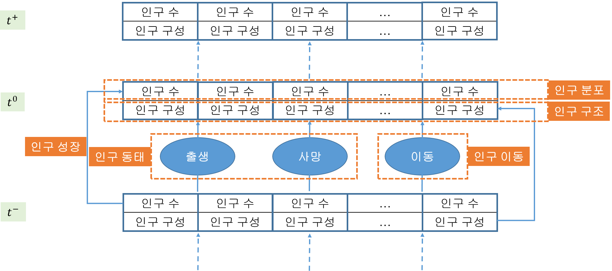
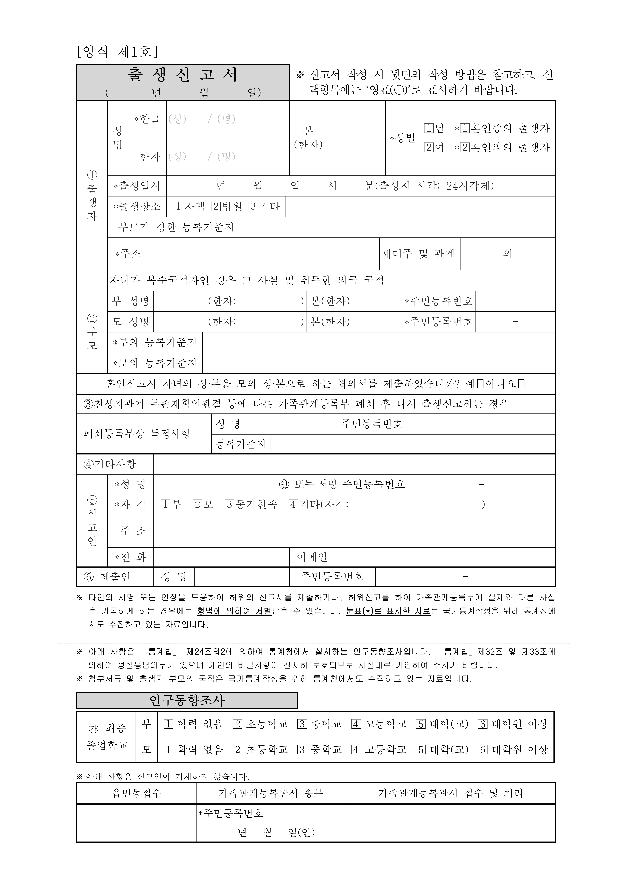
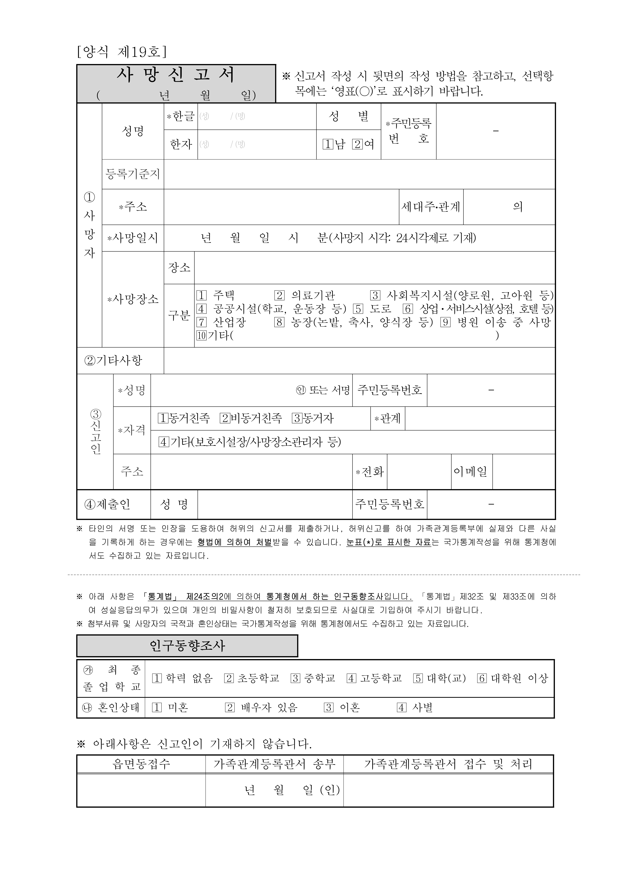
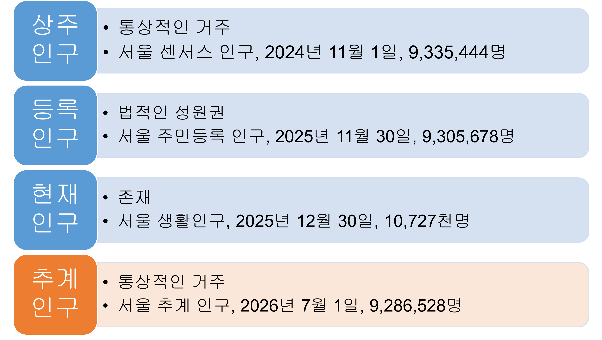
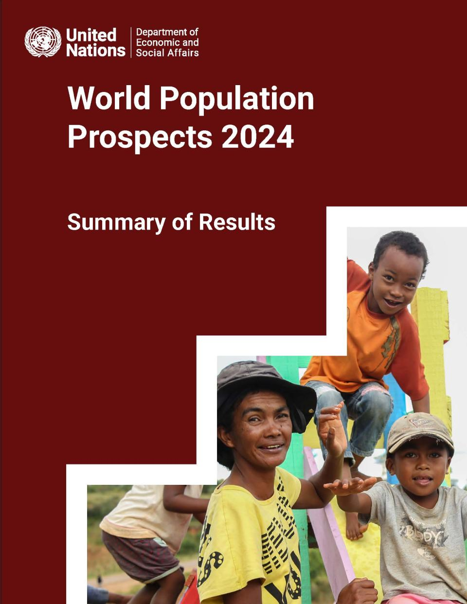

# [개요]{style="color:coral"}

## 

{style="font-size:1rem"}](https://miro.medium.com/v2/resize:fit:1400/format:webp/1*HlCF87afQQcZQv1HDjw9NQ.png)

## 인구 현상의 유형 구분과 5대 주제

+---------------------+--------------------+--------------------------+
|                     | 정적               | 동적                     |
+:===================:+:==================:+:========================:+
| **프로세스(원인)**  | \-                 | 인구 동태                |
|                     |                    |                          |
|                     |                    | 인구 이동                |
+---------------------+--------------------+--------------------------+
| **패턴(결과)**      | 인구 분포          | 인구 성장                |
|                     |                    |                          |
|                     | 인구 구조          |                          |
+---------------------+--------------------+--------------------------+

: {tbl-colwidths="\[40, 30, 30\]"}

::: {style="font-size: 3rem"}

-   인구 성장: 인구 수의 변화

-   인구 분포: 인구 수의 지리적 배열

-   인구 구조: 속성에 의거한 인구 구성

-   인구 동태: 출생, 사망

-   인구 이동: 통상적 거주지 상의 변동

:::

## 인구학적 인과-누적 매커니즘

# [인구 데이터]{style="color:coral"}

## 인구 데이터와 나

{style="font-size:1rem"}](images/population_io_1.PNG)

## 인구 데이터와 나

{style="font-size:1rem"}](images/population_io_2.PNG)

## 인구 데이터의 4대 원천

-   인구 센서스(census)

-   동태 통계(vital statistics)

-   행정 통계(administrative statistics)

-   서베이 데이터(survey data)

## 인구 데이터의 원천: 인구 센서스

{style="font-size:1rem"}](https://upload.wikimedia.org/wikipedia/commons/thumb/0/09/Lastcensus.svg/2560px-Lastcensus.svg.png)

## 인구 데이터의 원천: 인구 센서스

{style="font-size:1rem"}](http://www.adinews.co.kr/news/photo/202510/66384_121965_434.jpg){fig-align="center"}

## 인구 데이터의 원천: 동태 통계

::: {layout-ncol="2"}
{width="650px"}

{height="550px"}
:::

## 인구 데이터의 원천: 행정 통계

{style="font-size:1rem"}](images/clipboard-3678462296.jpeg){fig-align="center"}

## 인구 데이터의 원천: 서베이 데이터

{style="font-size:1rem"}](https://www.gangdong.go.kr/assets/crosseditor/binary/images/000089/2024%EA%B0%80%EC%A1%B1%EA%B3%BC%EC%B6%9C%EC%82%B0%EC%A1%B0%EC%82%AC.jpg){fig-align="center"}

## 인구 데이터의 원천과 인구의 공간 귀속

{fig-align="center"}

::: {style="font-size: 1.75rem; line-height:2"}
\[KOSIS(국가통계포털)(<https://kosis.kr/>)\]   \[서울 열린데이터 광장: 서울 생활인구(<https://data.seoul.go.kr/dataVisual/seoul/seoulLivingPopulation.do>)\]
:::

## 인구감소지역 지원 특별법: 2023.1.1. 시행

{style="font-size:1rem"}](https://flexible.img.hani.co.kr/flexible/normal/640/635/imgdb/original/2023/0913/20230913502518.webp){fig-align="center"}

## 인구 데이터: 세계

::: {layout="[60,40]" layout-valign="center"}
{style="font-size:1rem"}](images/wpp2024.PNG)

:::

## 

{style="font-size:0.5rem"}](https://unpkfc.org/wp-content/uploads/2022/07/Presentation1.jpg){fig-align="center"}

## 인구 데이터: 우리나라

{style="font-size:1rem"}](images/kosis.PNG)

## 인구 데이터: 우리나라

{style="font-size:1rem"}](images/통계지리정보서비스.PNG)

## 인구 데이터의 공간 체계

-   세계: UN 지오스킴(geoscheme)

    -   Subregions: 22개

    -   Regions: 6개

    -   SDG (Sustainable Development Goal) Regions: 7

-   우리나라: 2025년 1월 1일 기준

    -   시도 수준: 17

    -   시군구 수준: 226개 혹은 229개

    -   읍면동 수준: 3,560개

## 국가

## Subregions: 22

## Regions: 6

.jpg)

## SDG Regions: 7

.jpg)

## 우리나라

::: {layout-ncol="3" style="font-size:3rem; text-align: center;"}

:::

[(2025년 1월 1일 기준)]{style="font-size:1.25rem"}

## 서울

::: {layout-ncol="3" style="font-size:3rem; text-align: center;"}

:::

[(2024년 6월 30일 기준)]{style="font-size:1.25rem"}

## 인구 웹 앱 예시

<https://sangillee.snu.ac.kr/dashboard_popgeo/>
