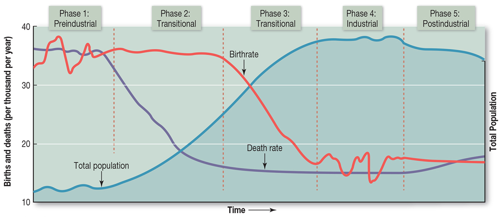

# [인구 성장]{style="color:coral"}   [인구 수의 변화]{style="font-size:4rem"}

## 인구 폭발 vs. 인구 절벽

::: {layout-ncol="2"}
{style="font-size:0.5rem"}](https://atqnews.com/wp-content/uploads/2023/11/Mariam-NatabanzI.jpg)

:::

## 인구 성장의 분해

-   인구학적 균형 방정식(demographic balancing equation)

    -   $P_t-P_0=B-D+I-O$

        -   $P_t$: $t$ 시점의 인구

        -   $P_0$: 기준 시점의 인구

        -   $B$: 출생

        -   $D$: 사망

        -   $I$: 전입

        -   $O$: 전출

    -   $B-D$: 자연 증가(natural increase) -\> 자연 변화(natural change)

    -   $I-O$: 순이동(net migration) 혹은 사회 증가(social increase)

## 인구 성장의 측정

-   자연변화율(rate of natural change, RNC): 자연증감율

-   $RNC=\frac{B-D}{P_M}\times 1,000$

    -   $P_M$: 연앙인구(mid-year population)

-   우리나라 2024년의 RNC

    -   $RNC=\frac{238,317-358,569}{51,037,252.5}\times 1,000=-2.356$ (-0.236%)

## 인구 성장의 측정

-   인구성장률(population growth rate, PGR): 인구증감율

    -   연평균 인구성장률 혹은 연평균 인구증감율

    -   기간을 1년으로 환산했을 때의 PGR: 연간 인구 증가의 속도

-   자연대수법: $P_n=P_0e^{rn}$ -\> $r=\frac{1}{n}\ln\frac{P_n}{P_0}$

-   우리나라 2020\~2024년 PGR

    -   $r=\frac{1}{4}\ln\frac{51,805,547}{51,829,136}=-0.000114$ (-0.011%)

## 인구 성장의 측정

-   배가기간(doubling time)

    -   인구가 두 배로 증가하는데 걸리는 시간(주로 연수)

    -   인구성장률과 반비례 관계

-   $r=\frac{1}{n}\ln\frac{P_n}{P_0}$ -\> $n=\frac{1}{r}\ln2=\frac{0.693}{r}=\frac{69.3}{r(\%)}\cong\frac{70}{r(\%)}$

-   세계의 배가기간

    -   2025년 PGR 기준: $\frac{69.3}{0.841}\cong82.4$

-   우리나라의 배가기간

    -   2020-2024 PGR 기준: $\frac{69.3}{-0.011}\cong -6,300?$

## 인구 성장의 모델: 인구변천모델

## 

30977-6/fulltext){style="font-size:1rem"}](https://www.thelancet.com/cms/10.1016/S0140-6736(20)30977-6/asset/f149aba2-2b7a-4329-809a-b8f7e1ab7e8b/main.assets/gr10_lrg.jpg)

## 인구배당효과(demographic dividend)

'인구학적 덫(demographic trap)'

{style="font-size:1rem"}](images/clipboard-1652928001.png)

## 세계: 전체

## 세계: Region

## 세계: Subregion

## 세계: Subregions

## 세계: 국가

,%202025.jpg)

## 세계: 국가

, 2025.jpg)

## 세계: 국가

## 세계: 국가

## 우리나라: 혼란스러운 데이터

-   우리나라의 현재 인구는?: 세 종류

    -   인구총조사(2024년 11월 1일 기준): 51,805,547명

        -   내국인 49,762,803명, 외국인 2,042,744명

    -   주민등록인구(2025년 11월 30일 기준): 51,128,530명

        -   외국인 등록인구(2025년 9월 30일 기준): 1,598,380명

    -   추계인구(2026년 7월 1일 기준): 51,609,121명

        -   2024년 공표(2022년 인구 기준), 1960\~2072년, 인구센서스 기반

-   2010년 인구총조사 인구는 2개

    -   기존의 직접 조사 방식에 의거한 인구: 48,580,293명

    -   등록센서스 방식에 의거한 인구: 49,710,672명

## 우리나라: 전체

## 우리나라: 인구변천모델

## 우리나라: 권역

## 우리나라: 시도

## 우리나라: 시군구

::: {layout-ncol="3"}

:::

## 우리나라: 미래 전망

## 인구 웹 앱 예시

<https://sangillee.snu.ac.kr/dashboard_popgeo/>
