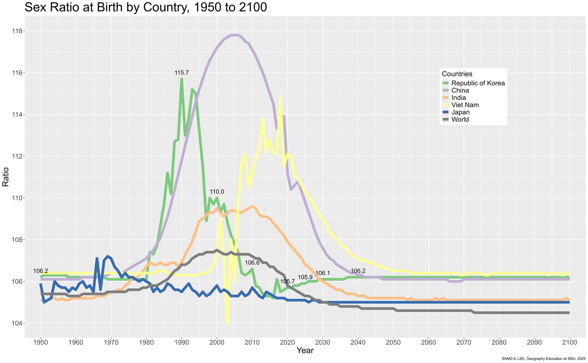
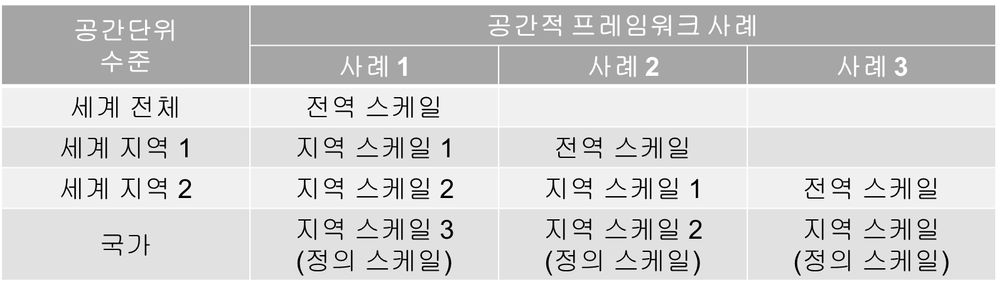
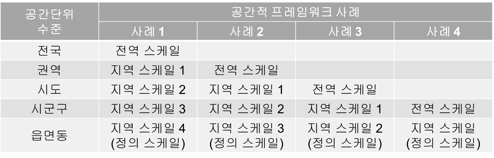
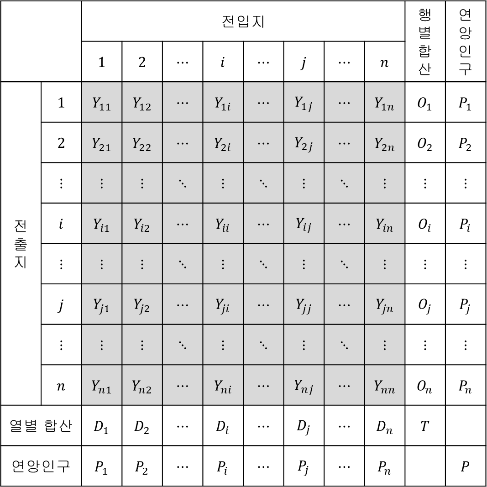
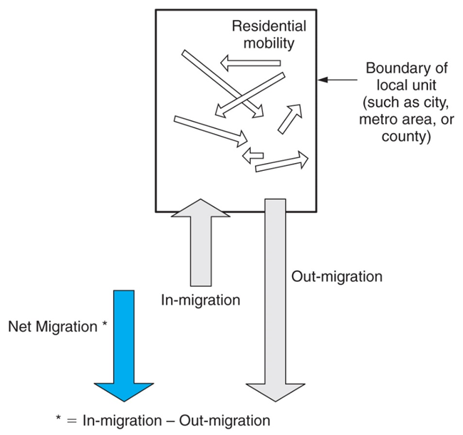
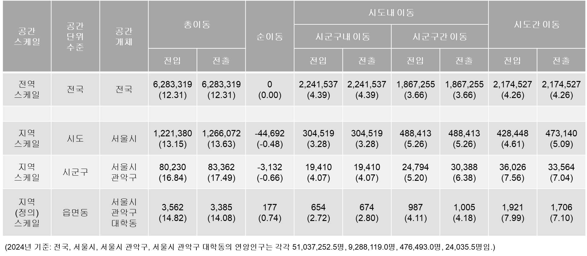
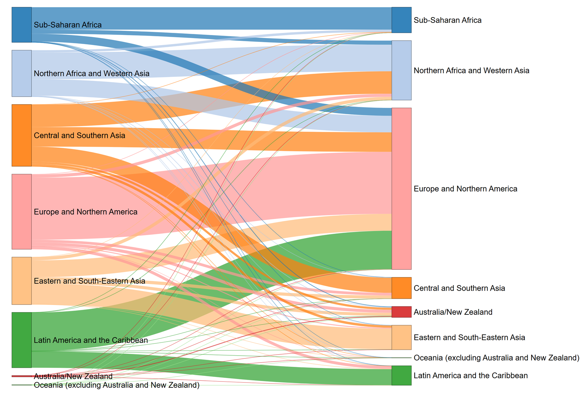

# [인구 구조]{style="color:coral"}   [속성에 의거한 인구 구성]{style="font-size:4rem"}

## 인구 구조의 종류

-   생물학적 인구 구조

    -   성별ᆞ연령별 인구 구조
    -   혈액형, MBTI의 인구 구조 등

-   사회ᆞ경제ᆞ문화적 인구 구조

    -   산업 및 직업, 계층, 교육수준, 종교, 취향 등

## 인구 구조의 측정 및 시각화

-   성별 구조

    -   성비: 전체 성비, 출생성비, 연령별 성비

-   연령별 구조

    -   중위연령

    -   연령(층) 비중: 유소년층(0-14), 청장년층(15-64), 노년층(65세 이상)

-   인구 피라미드

    -   성별ᆞ연령별 인구 구조의 시각화 기법

-   인구 고령화

    -   노인 인구 비중, 노령화 지수

-   부양 인구비: 인구 구조에 대한 경제적 해석

    -   총부양인구비/유소년부양인구비/노년부양인구비

## 세계: 성비, Region

## 세계: 성비, Subregion

## 세계: 성비, 국가

## 세계: 성비, 국가

## 세계: 성비, 주요 국가

{fig-align="center"}

## 세계: 중위연령, Region

## 세계: 중위연령, Subregion

## 세계: 연령 구조, Region

## 세계: 연령 구조, 국가

## 세계: 연령 구조, 국가

## 세계: 연령 구조, 국가

## 우리나라: 성비, 시군구

{fig-align="center"}

## 우리나라: 중위연령, 시군구

{fig-align="center"}

## 우리나라: 연령 구조

## 우리나라: 인구 피라미드

::: {layout-ncol="4"}

:::

## 우리나라: 인구 피라미드

{fig-align="center"}

## 우리나라: 부양인구비

## 우리나라: 학령인구감소

## 우리나라: 1인가구 비중 증가

## 우리나라: 1인가구 비중 증가

{fig-align="center"}

## 인구 웹 앱 예시

<https://sangillee.snu.ac.kr/dashboard_popgeo/>

# [인구 동태]{style="color:coral"}   [출생과 사망]{style="font-size:4rem"}

## 출산력의 측정: CBR

-   조출생률(crude birth rate)

-   인구 1,000명 당 출생아 수

-   $CBR=\frac{B}{P}\times1,000$

    -   $B$: 출생아 수

    -   $P$: 연앙인구

-   장점

    -   자료 획득이 용이, 계산이 편리

    -   출생이 인구 증가에 기여한 정도 파악 용이

-   단점: 실질적인 출산력 측정에 한계, 인구 간 출산력 비교의 어려움

    -   인구 구조(가임연령층 인구 비중)의 효과 + 혼인율(출산가담률)의 차이

## 

## 출산력의 측정: TFR

-   합계출산율(total fertility rate)

-   현 연령(층)별 출산율이 변화하지 않을 경우, 한 여성이 평생 동안 낳는 평균 자녀 수

-   $TFR=A\times\sum_a\frac{B_a}{F_a}$

    -   $A$: 연령(층)의 단위 연수(예: 1 혹은 5)

    -   한 여성이 가임연령 기간(보통 15-49세)를 거치면서 각게 되는 각세별 출산 확률의 합산값

-   장점

    -   가장 합리적, 가장 널리 사용됨

    -   인구대체수준(population replacement level): 인구 규모를 유지하기 위한 최소한의 출산 수준 -\> TFR = 2.1

-   단점: 기간 합계출산율 vs. 코호트 합계출산율

## 

## 출산: 세계, TFR, Subregion

%20by%20Subregion,%202025.jpg)

## 출산: 세계, TFR, 국가

,%202025.jpg)

## 출산: 우리나라, CBR, 전체

## 출산: 우리나라, CBR vs. TFR, 전체

## 출산: 우리나라, CBR vs. TFR, 시군구

::: {layout-ncol="2" style="justify-items: center"}
,%202023.jpg){style="height:900px"}

,%202023.jpg){style="height:900px"}
:::

## 사망력의 측정: CDR

-   조사망률(crude death rate)

-   $CDR=\frac{D}{P}\times1,000$

    -   $D$: 사망자 수

    -   $P$: 연앙인구

-   장점

    -   자료 획득이 용이, 계산이 간편

    -   사망이 인구 감소에 기여한 정도 파악 용이

-   단점: 실질적인 사망력 측정에 한계, 인구 간 비교의 어려움

    -   인구 구조(노년층 비중)의 효과

## 

## 사망력의 측정: SDR

-   표준화 사망률(standardized death rate)

-   해당 인구의 연령층별 사망률 데이터가 존재할 경우

-   표준(준거) 인구의 연령 구조(인구 규모 포함)를 상정했을 때의 조사망률을 계산

-   $SDR=\frac{\sum_a(\frac{D_{a,r}}{P_{a,r}})\times P_{a,s}}{P_s}\times 1,000$

    -   $D_{a,r}$: 해당 인구 $r$의 $a$ 연령층 사망자 수

    -   $P_{a,r}$: 해당 인구 $r$의 $a$ 연령층 인구 수

    -   $P_{a,s}$: 표준(준거) 인구 $s$의 $a$ 연령 인구 수

    -   $P_s$: 표준(준거) 인구 $s$의 전체 인구 수

## 

## 사망: 세계, CDR, Subregion

%20by%20Subregion,%202025.jpg)

## 사망: 세계, CDR, 국가

,%202025.jpg)

## 사망: 우리나라, CDR, 전체

## 사망: 우리나라, CDR vs. SDR, 시군구

::: {layout-ncol="2" style="justify-items: center"}
,%202023.jpg){style="height:900px"}

,%202023.jpg){style="height:900px"}
:::

## 자연변화: 우리나라, 전체

## 자연변화: 우리나라, 시군구

,%202023sgg2.jpg){fig-align="center"}

## 인구 웹 앱 예시

<https://sangillee.snu.ac.kr/dashboard_popgeo/>

# [인구 이동]{style="color:coral"}   [통상적 거주지 상의 변동]{style="font-size:4rem"}

## 인구 이동 연구의 공간적 프레임워크: 개념

-   전역 스케일과 지역 스케일의 결정을 포함한 인구 이동 연구의 공간적 세팅

-   전역 스케일(global scale)

    -   인구 이동이 고려되는 폐쇄 시스템의 외연, 공간범위(spatial scope)

-   지역 스케일(regional scale)

    -   전역 스케일을 구성하는 공간개체들, 공간단위(spatial unit)

## 인구 이동 연구의 공간적 프레임워크: 국제

## 인구 이동 연구의 공간적 프레임워크: 국내

## 측정: 전역 스케일

-   총이동 및 총이동률

    -   총이동(gross migration, GR): 특정한 전역 스케일 내에서 발생한 총 이동자 수

        -   연간 국제 인구 이동자 수

        -   연간 국내 인구 이동자 수: 우리나라의 경우 2024년 6,283,319명

    -   총이동률(gross migration rate, GMR): 총이동을 연앙인구로 나누어 백분률로 나타낸 것으로, 이동력(이동 경향성, 이동 확률)의 총체적 지표

        -   $GMR=\frac{GM}{P}\times 100$

        -   연간 국제 총이동률

        -   연간 국내 총이동률: 우리나라의 경우 2024년 12.3%

-   성별ᆞ연령별 이동 및 이동률

    -   $GMR^s_a=\frac{GM^s_a}{P^s_a}\times 100$

    -   우리나라: 2024년 20-24세 21.7%, 55-59세 8.5%

## 측정: 전역 스케일

-   '전역 스케일 측도의 지역 스케일 의존성'

-   특정한 지역 스케일의 공간단위 경계를 가로지르는 인구 이동

-   총이동(총이동률)(우리나라, 2024년)

    -   읍면동(정의 스케일): 6,283,319명(12.3%)

    -   시군구 스케일: 4,041,782명(7.9%)

    -   시도 스케일: 2,174,527명(4.3%)

    -   시군 스케일: 2,984,000명(5.8%)

## 측정: 지역 스케일

-   규모

    -   전입(im-migration, $IM_i$): 다른 지역을 떠나 해당 지역으로 이동한 인구 -\> 전입자수

    -   전출(out-migration, $OM_i$): 해당 지역을 떠나 다른 지역으로 이동한 인구 -\> 전출자수

    -   총이동(gross migration, $GM_i$): 전입 + 전출 -\> $GM_i=IM_i+OM_i$

        -   이동의 전체적인 규모

        -   전역적 스케일의 총이동과 다른 개념

    -   순이동(net migration, $NM_i$): 전입 - 전출 -\> $NM_i=IM_i-OM_i$

        -   양수: 전입 초과 혹은 순전입(net in-migration)

        -   음수: 전출 초과 혹은 순전출(net out-migration)

## 측정: 지역 스케일

::: {layout="[60,40]" layout-valign="center"}

:::

## 측정: 지역 스케일

-   비율: 규모를 연앙인구에 대한 백분율(%)로 나타낸 것

    -   전입률(in-migration rate): $IMR_i=\frac{IM_i}{P}\times 100$

        -   전입이 인구 증가에 기여하는 정도

    -   전출률(out-migration rate): $OMR_i=\frac{OM_i}{P}\times 100$

        -   전출이 인구 감소에 기여하는 정도

        -   인구 이동의 확률: 전출 확률

    -   총이동률(gross migration rate): $GMR_i=\frac{IM_i+OM_i}{P}\times 100$

    -   순이동률(net migration, rate): $NMR_i=\frac{IM_i-OM_i}{P}\times 100$

        -   사회 증감이 인구 증감에 기여하는 정도

## 측정: 지역 스케일

## 세계: NM, SDG Region

## 세계: NM, 국가

## 세계: NMR, 국가

,%202025.jpg)

## 세계: 국제 인구 이동 스톡 데이터

{style="font-size:1rem"}](images/undesa_pd_2025_intlmigstock_2024_key_facts_and_figures_advance-unedited_1.jpg){fig-align="center"}

## 세계: IMS, 전체

-   총이동

    -   153,916,063(1990년) -\> 174,566,152(2000년) -\> 221,020,392(2010) -\> 250,042,020(2015) -\> 275,284,031(2020) -\> 304,021,813(2024)

    -   2024년 현재 304,021,813명의 인구가 자신이 태어나지 않은 나라에 살고 있음.

-   총이동률(%)

    -   2.9(1990) -\> 2.8(2000) -\> 3.1(2010) -\> 3.3(2015) -\> 3.5(2020) -\> 3.7(2024)

    -   2024년 현재 전 세계 인구의 3.7%가 자신이 태어나지 않은 나라에 살고 있음

## 세계: IMS, SDG Region

{fig-align="center"}

## 세계: IMS(도착지 기준), 국가

## 세계: IMS(도착지 기준), 우리나라

## 세계: IMS(출발지 기준), 국가

## 세계: IMS(출발지 기준), 우리나라

## 세계: 외국 태생자 비중, 국가

## 우리나라: GM, GMR, 전체

## 우리나라: NM, 권역간, 2024년

![[통계청, 2024년 국내인구이동통계 결과, 보도자료, 2025년 1월 24일]{style="font-size:1rem"}](images/clipboard-1688816976.png){fig-align="center"}

## 우리나라: NM, NMR, 시도

## 우리나라: 인구 이동 흐름(전체 인구), 시도

{fig-align="center"}

## 우리나라: 인구 이동 흐름(20-24세), 시도

{fig-align="center"}

## 우리나라: 인구 이동 흐름(65-69세), 시도

{fig-align="center"}

## 우리나라: NMR, 시군구

,%202024.jpg){fig-align="center"}

## 우리나라: 연령별 NM, 서울

## 우리나라: 연령별 NM, 경기

## 인구 웹 앱 예시

<https://sangillee.snu.ac.kr/dashboard_popgeo/>
