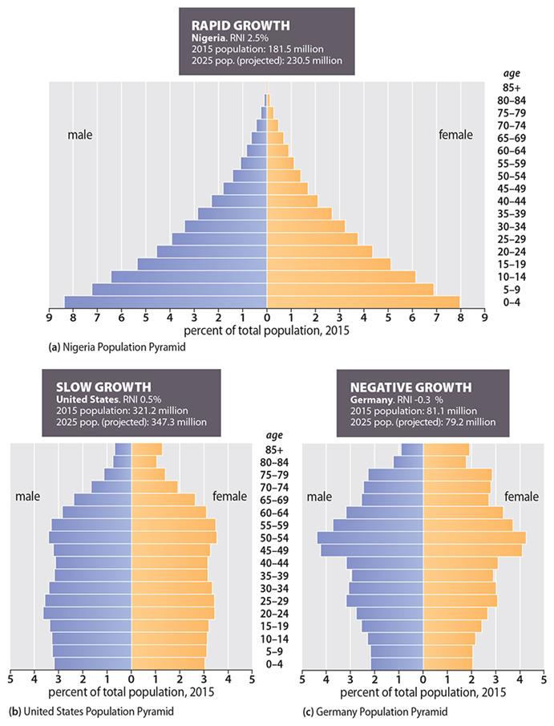
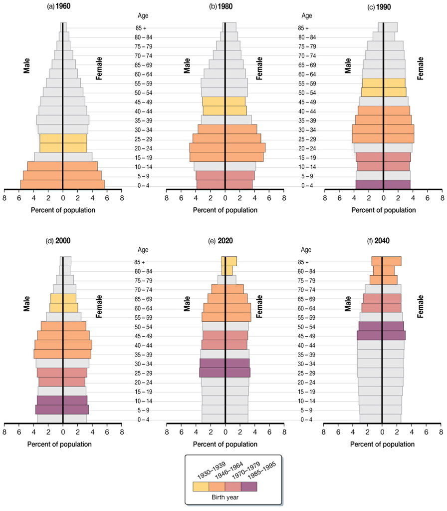
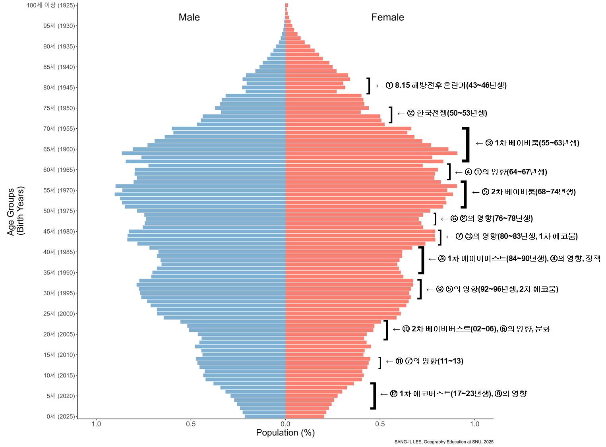

# [인구 구조]{style="color:coral"}   [속성에 의거한 인구 구성]{style="font-size:4rem"}

## 인구 구조의 종류

-   생물학적 인구 구조

    -   성별ᆞ연령별 인구 구조
    -   혈액형, MBTI의 인구 구조 등

-   사회ᆞ경제ᆞ문화적 인구 구조

    -   산업 및 직업, 계층, 교육수준, 종교, 취향 등

## 인구 구조의 측정

-   성비: 남성과 여성의 구성비

    -   $SR=\frac{M}{F}\times 100$

    -   여성 100명에 대한 상대적인 남성의 수

    -   100 이상일 경우 '남초(현상)', 100 미만일 경우 '여초(현상)'

-   종류

    -   일반 성비: 전체 인구의 성비

    -   출생성비(sex ratio at birth): 대략 103-107 정도

    -   연령별 성비

        -   남녀 간의 사망력의 차이 반영

        -   일반적으로 40-50대 이후부터는 여초

-   일반 성비의 결정 요소

    -   출생성비, 성별 사망률의 차이, 이주자의 성비

## 인구 구조의 측정

-   중위연령(median age)

    -   한 인구 집단을 연령 순서로 배열했을 때 정가운데에 위치하는 사람의 연령

    -   평균연령(mean age)와 다름

-   연령(층)별 비중

    -   유소년층(0-14세), 청장년층(15-64세), 노년층(65세 이상)

    -   최근 UN: 0-4, 5-14, 15-24, 25-64, 65세 이상

    -   생애주기단계: 학령 인구(6-17세), 청년층(25-34세), 중장년층(40-64세) 등

-   노령화지수(ACR, the aged to child ratio)

    -   유소년층 인구 100명에 대한 노년층 인구 수

    -   $ACR=\frac{P_{65+}}{P_{0-14}}\times 100$

## 인구 구조의 시각화

-   인구 피라미드의 개념

    -   **성별ᆞ연령별** 인구 구조에 대한 가장 효과적인 시각화 수단

    -   수평축: 연령(층)별 인구 수 혹은 인구 비중/ 남녀 구분

    -   수직축: 연령(층)

-   인구 피라미드의 유형과 인구변천모델

    -   확대형: 인구의 급격한 증가, 2기 후반 - 3기 초반, 피라미드형

    -   안정형: 인구의 완반한 증가 혹은 정체, 3기 중후반 - 4기, 종형, 포탄형

    -   수축형: 인구 감소, 5기, 방추형, 항아리형

## 인구 구조의 시각화

{fig-align="center" style="height:900px"}

## 인구 구조의 시각화

{fig-align="center" style="height:900px"}

## 인구 구조의 사회 이슈화

-   '성비 불균형(gender imbalance)'

    -   성비가 100으로부터 '상당히' 벗어나 있는 상태

-   '인구 고령화(population aging)'

    -   한 인구의 전반적인 연령이 '상당한' 수준으로 높아지는 현상

    -   중위 연령의 상승, 노령화지수의 상승

    -   노년층 인구 비중의 증가

        -   고령화 사회(aging society): 7-14%

        -   고령 사회(aged society): 14-20%

        -   초고령 사회(super-aged society): 20% 이상

-   '학령 인구 감소(school-age population decrease)'

    -   학생 연령층의 상대적으로 높은 인구 감소율

## 인구 구조의 사회 이슈화

-   부양인구비: 개념

    -   인구 구조를 부양이라는 '경제적 부담'으로 해석

    -   부양 인구(청장년층) 대비 피부양 인구(유소년층 & 노년층)의 비(ratio)

-   측도

    -   총부양인구비(TDR, total dependency ratio)

        -   $TDR=\frac{P_{0-14}+P_{65+}}{P_{15-64}}\times 100$

        -   $TDR=YDR+ODR$

    -   유소년부양인구비(YDR, youth (child) dependency ratio)

        -   $YDR=\frac{P_{0-14}}{P_{15-64}}\times 100$

    -   노년부양인구비(ODR, old-age dependency ratio)

        -   $ODR=\frac{P_{65+}}{P_{15-64}}\times 100$

## 세계: 성비, Region

## 세계: 성비, Subregion

## 세계: 성비, 국가

## 세계: 성비, 국가

## 세계: 성비, 주요 국가

## 세계: 중위연령, Region

## 세계: 중위연령, Subregion

## 세계: 중위 연령, 국가

## 세계: 연령 구조, Region

## 세계: 연령 구조, 국가

## 세계: 연령 구조, 국가

## 세계: 연령 구조, 국가

## 세계: 인구 피라미드

{fig-align="center" style="height:900px"}

## 세계: 인구부양비

## 우리나라: 성비, 전체

## 우리나라: 성비, 시군구

{fig-align="center"}

## 우리나라: 중위연령, 전체

## 우리나라: 중위연령, 시군구

{fig-align="center"}

## 우리나라: 중위연령, 서울, 동

{fig-align="center"}

## 우리나라: 연령 구조

## 우리나라: 인구 피라미드

::: {layout-ncol="4"}

:::

## 우리나라: 인구 피라미드

{fig-align="center"}

## 우리나라: 인구 고령화

,%201960~2072.jpg)

## 우리나라: 부양인구비

## 우리나라: 학령 인구 감소

## 우리나라: 1인가구 비중 증가, 전체

## 우리나라: 1인가구 비중 증가, 시군구

{fig-align="center"}

## 우리나라: 1인가구 비중 증가, 서울, 동

{fig-align="center"}

## 인구 웹 앱 예시

<https://sangillee.snu.ac.kr/dashboard_popgeo/>
