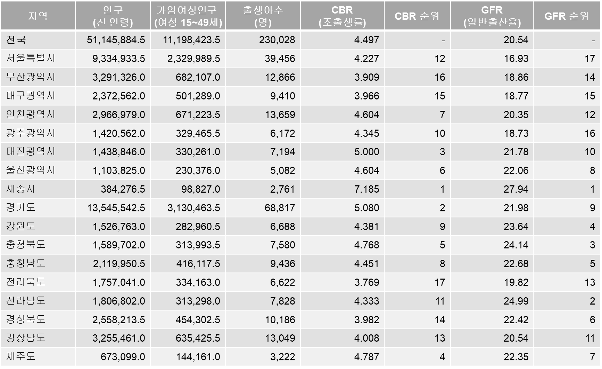
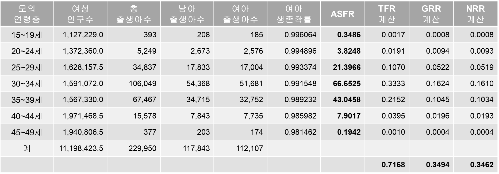
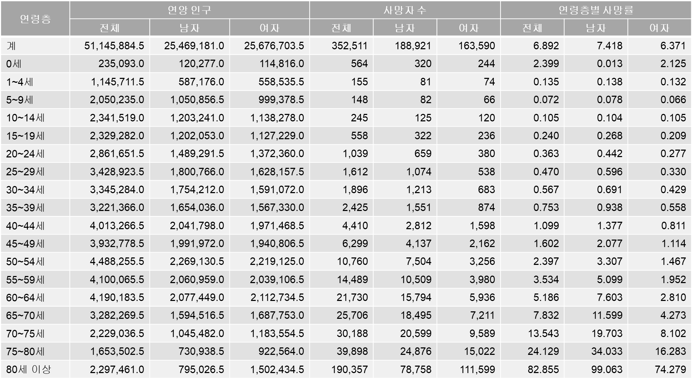
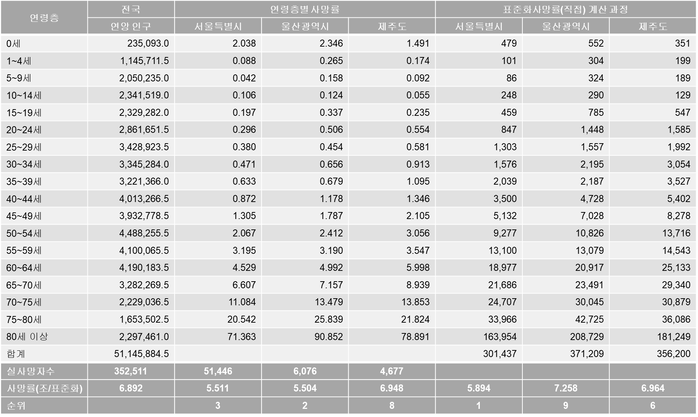

# [인구 동태]{style="color:coral"}   [출생과 사망]{style="font-size:4rem"}

## 출산력의 측정: CBR

-   조출생률(crude birth rate)

-   인구 1,000명 당 출생아 수

-   $CBR=\frac{B}{P_M}\times1,000$

    -   $B$: 출생아 수

    -   $P_M$: 연앙인구

-   장점

    -   자료 획득이 용이, 계산이 편리

    -   출생이 인구 증가에 기여한 정도 파악 용이

-   단점: 실질적인 출산력 측정에 한계, 인구 간 출산력 비교의 어려움

    -   인구 구조(가임연령층 인구 비중)의 효과 + 혼인율(출산가담률)의 차이

## 

## 출산력의 측정: TFR

-   합계출산율(total fertility rate)

-   현 연령(층)별 출산율이 변화하지 않을 경우, 한 여성이 평생 동안 낳는 평균 자녀 수

-   $TFR=A\times\sum_a\frac{B_a}{F_a}$

    -   $A$: 연령(층)의 단위 연수(예: 1 혹은 5)

    -   한 여성이 가임연령 기간(보통 15-49세)를 거치면서 각게 되는 각세별 출산 확률의 합산값

-   장점

    -   가장 합리적, 가장 널리 사용됨

    -   인구대체수준(population replacement level): 인구 규모를 유지하기 위한 최소한의 출산 수준 -\> TFR = 2.1

-   단점: 기간 합계출산율 vs. 코호트 합계출산율

## 

## 출산: 세계, TFR, Subregion

%20by%20Subregion,%202025.jpg)

## 출산: 세계, TFR, 국가

,%202025.jpg)

## 출산: 우리나라, CBR, 전체

## 출산: 우리나라, CBR vs. TFR, 전체

## 출산: 우리나라, CBR vs. TFR, 시군구

::: {layout-ncol="2" style="justify-items: center"}
,%202023.jpg){style="height:900px"}

,%202023.jpg){style="height:900px"}
:::

## 사망력의 측정: CDR

-   조사망률(crude death rate)

-   $CDR=\frac{D}{P_M}\times1,000$

    -   $D$: 사망자 수

    -   $P_M$: 연앙인구

-   장점

    -   자료 획득이 용이, 계산이 간편

    -   사망이 인구 감소에 기여한 정도 파악 용이

-   단점: 실질적인 사망력 측정에 한계, 인구 간 비교의 어려움

    -   인구 구조(노년층 비중)의 효과

## 

## 사망력의 측정: SDR

-   표준화 사망률(standardized death rate)

-   해당 인구의 연령층별 사망률 데이터가 존재할 경우

-   표준(준거) 인구의 연령 구조(인구 규모 포함)를 상정했을 때의 조사망률을 계산

-   $SDR=\frac{\sum_a(\frac{D_{a,r}}{P_{a,r}}\times P_{a,s})}{P_s}\times 1,000$

    -   $D_{a,r}$: 해당 인구 $r$의 $a$ 연령층 사망자 수

    -   $P_{a,r}$: 해당 인구 $r$의 $a$ 연령층 인구 수

    -   $P_{a,s}$: 표준(준거) 인구 $s$의 $a$ 연령 인구 수

    -   $P_s$: 표준(준거) 인구 $s$의 전체 인구 수

## 

## 사망: 세계, CDR, Subregion

%20by%20Subregion,%202025.jpg)

## 사망: 세계, CDR, 국가

,%202025.jpg)

## 사망: 우리나라, CDR, 전체

## 사망: 우리나라, CDR vs. SDR, 시군구

::: {layout-ncol="2" style="justify-items: center"}
,%202023.jpg){style="height:900px"}

,%202023.jpg){style="height:900px"}
:::

## 자연변화: 우리나라, 전체

## 자연변화: 우리나라, 시군구

,%202023sgg2.jpg){fig-align="center"}

## 인구 웹 앱 예시

<https://sangillee.snu.ac.kr/dashboard_popgeo/>
