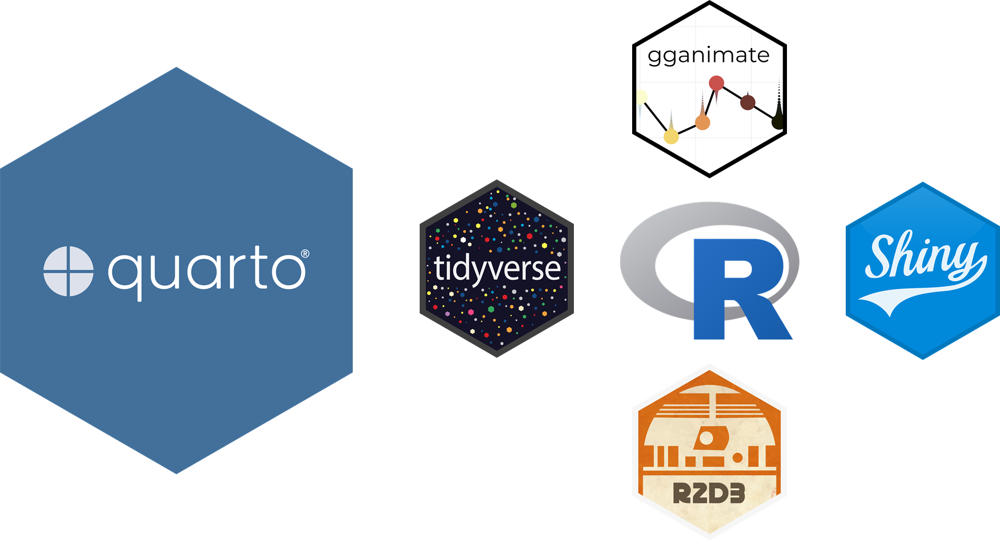
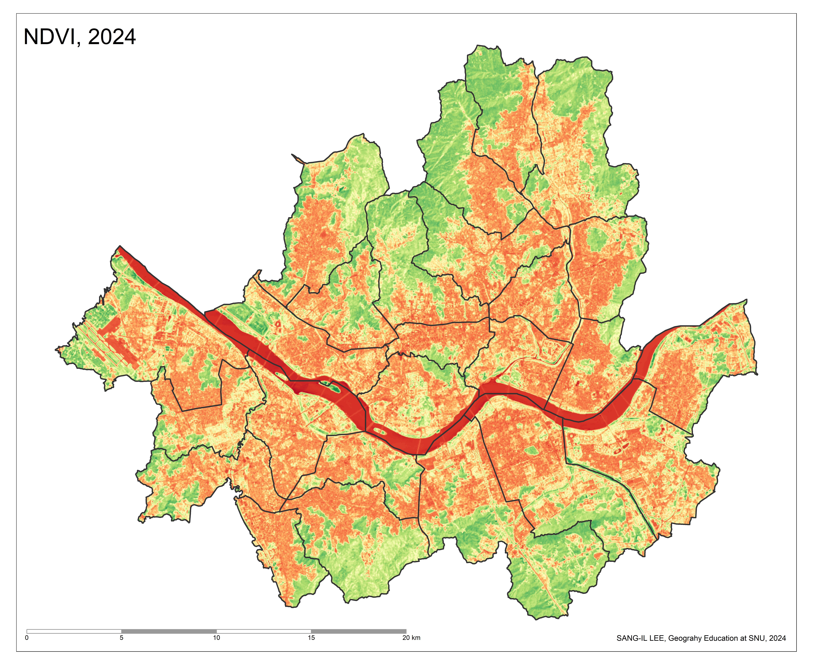

# [인터랙티브 시각화]{style="color:coral"}

## Quarto/R 기반의 웹 앱 개발 프레임워크



## 동적ㆍ반응형 시각화의 구현

-   역동성과 상호작용성이 부가된 시각화

-   구현 방식

    -   임베딩(embedding): 외부 콘텐츠 삽입

    -   동적ㆍ반응형 내용 요소의 직접 제작

## 옵션 1: 임베딩

-   개념

    -   외부 웹 사이트/앱의 콘텐츠를 현재 웹 사이트/앱 안에 삽입하여 보여주는 기법

    -   HTML의 `iframe` 태그 활용

    -   별도의 페이지 전환 없이 다른 서비스나 시각화 결과를 한 웹 앱에 통합

    -   일부 사이트는 임베딩 불가능

-   대상

    -   동적ㆍ반응형 시각화 웹 사이트/앱

    -   상호작용형 교육ㆍ협업 도구: Padlet, Mentimeter, Google Forms 등

    -   동영상: YouTube

## 옵션 2: 직접 제작

-   R 패키지 활용

    -   동적ㆍ반응형 내용 요소 제작을 지원하는 R 자체 패키지

    -   [**gganimate**](https://gganimate.com/)**,** [**ggiraph**](https://davidgohel.github.io/ggiraph/)

-   R 래퍼 패키지 활용

    -   JS 라이브러리와의 가교

    -   [**DT**](https://rstudio.github.io/DT/), [**plotly**](https://plotly.com/r/)

-   결합

    -   R 패키지로 제작한 정적 콘텐츠를 R 래퍼 패키지를 통해 동적ㆍ반응형 콘텐츠로 전환

    -   [**ggplot2**](https://ggplot2.tidyverse.org/) + [**plotly**](https://plotly.com/r/)

## 임베딩: 사례 1

-   통계놀이터(<https://kosis.kr/edu/>)

::: panel-tabset
## Code

```         
<iframe src="https://kosis.kr/edu/share.do?shareID=S0500_16" 
loading="lazy" style="width: 100%; height: 600px; border: 
0px none;" allow="web-share; clipboard-write"></iframe>
```

## Result

```{=html}
<iframe data-external="1" src="https://kosis.kr/edu/share.do?shareID=S0500_16" loading="lazy" style="width: 100%; height: 600px; border:
0px none;" allow="web-share; clipboard-write">
```

</iframe>
:::

## 임베딩: 사례 2

-   Our World in Data(<https://ourworldindata.org/>)

::: panel-tabset
## Code

```         
<iframe src="https://ourworldindata.org/explorers/population-and-demography?indicator=Fertility+rate&Sex=Both+sexes&Age=Total&Projection+scenario=Medium&country=Asia+%28UN%29~Europe+%28UN%29~Africa+%28UN%29~Oceania+%28UN%29~Northern+America+%28UN%29~Latin+America+and+the+Caribbean+%28UN%29~OWID_WRL~KOR&tab=chart&hideControls=true" loading="lazy" style="width: 70%; height: 600px; border: 0px none;" allow="web-share; clipboard-write"></iframe>
```

## Result

```{=html}
<iframe data-external="1" src="https://ourworldindata.org/explorers/population-and-demography?indicator=Fertility+rate&amp;Sex=Both+sexes&amp;Age=Total&amp;Projection+scenario=Medium&amp;country=Asia+%28UN%29~Europe+%28UN%29~Africa+%28UN%29~Oceania+%28UN%29~Northern+America+%28UN%29~Latin+America+and+the+Caribbean+%28UN%29~OWID_WRL~KOR&amp;tab=chart&amp;hideControls=true" loading="lazy" style="width: 70%; height: 600px; border: 0px none;" allow="web-share; clipboard-write">

</iframe>
```
:::

## 테이블: 개요

-   테이블 역시 시각화의 일부

    -   데이터 변형 및 요약을 거친 정적 테이블

    -   시각성이 가미된 정적 테이블

    -   인터랙티브 테이블

-   테이블 디자인 원칙(핸즈온 데이터 시각화, 2022)

    -   열 제목을 데이터 상단에 눈에 띄게 만들어라.

    -   밝은 음영을 사용해 열이나 행을 구분하라.

    -   읽기 쉽도록 텍스트는 왼쪽 정렬하고 숫자는 오른쪽 정렬하라.

    -   레이블을 첫 번째 행에만 배치하여 중복을 피하라.

    -   테이터를 그룹화 및 정렬하여 의미 있는 패턴을 강조하라.

## 테이블: 도구의 분류

{style="font-size:1.25rem"}](https://sangillee.snu.ac.kr/2024_AIEDAP/images/clipboard-3923512479.png)

## 테이블: [**gt**](https://gt.rstudio.com/) 패키지

{style="font-size:1.25rem"}](https://gt.rstudio.com/reference/figures/gt_workflow_diagram.svg){fig-align="center"}

## 테이블: [**gt**](https://gt.rstudio.com/) 패키지

{style="font-size:1.25rem"}](https://gt.rstudio.com/reference/figures/gt_parts_of_a_table.svg){fig-align="center"}

## 테이블: [**gt**](https://gt.rstudio.com/) 패키지

{style="font-size:1.25rem"}](https://miro.medium.com/v2/resize:fit:1400/format:webp/1*lmJ_N_Hy3xGaB4W66L40FQ.jpeg)

## 테이블: [**flextable**](https://davidgohel.github.io/flextable/)패키지

-   웹북(<https://ardata-fr.github.io/flextable-book/>)

{style="font-size:1.25rem"}](images/clipboard-1943740998.png)

## 테이블: 인터랙티브 테이블

| 자바스크립트 라이브러리 | R 래퍼 패키지 |
|----|----|
| [DataTables](https://datatables.net/) | [DT](https://rstudio.github.io/DT/) |
| [Tanstack Table](https://tanstack.com/table/v7/) | [reactable](https://glin.github.io/reactable/) |

## 테이블: 래퍼 패키지 [**DT**](https://rstudio.github.io/DT/)

-   [DataTables](https://datatables.net/): 자바스크립트 라이브러리

-   R 래퍼 패키지: [**DT**](https://rstudio.github.io/DT/)

    -   웹북: [D3 for R Users](https://jtr13.github.io/d3book/)

{style="font-size:1.25rem"}](https://sangillee.snu.ac.kr/2024_AIEDAP/images/clipboard-4023553912.png)

## 테이블: 래퍼 패키지 [**DT**](https://rstudio.github.io/DT/)

-   Pagination: 페이지 이동 기능

-   Instant search: 즉각적 검색 기능(Search에 타이핑하기 시작하면 즉각적으로 검색 결과 보여줌)

-   Ordering/sorging: 컬럼 정렬 기능

-   Multi-column ordering: 다중 컬럼 정렬 기능(컬럼 하나를 선택한 후 ctrl을 누른 상태에서 다른 컬럼을 선택)

-   Filtering: 값 추림 기능

-   Editable: 셀 값 수정 기능

-   Buttons: 셀 숨기기 기능, CSV, PDF, XLSX 등의 확장자로 내보내기 등을 수행하는 버튼 생성 기능

## 테이블: 래퍼 패키지 [**DT**](https://rstudio.github.io/DT/) {.scrollable}

::: panel-tabset
## Code

```{r}
#| eval: false
#| echo: true
gapminder |> 
  datatable(
    filter = "top",
    extensions = "Buttons",
    options = list(
      pageLength = 5,
      autoWidth = TRUE,
      dom = "Bfrtip",
      buttons = c("copy", "excel", "pdf", "print")
    )
  )
```

## Result

```{r}
library(DT)
library(gapminder)
gapminder |> 
  datatable(
    filter = "top",
    extensions = "Buttons",
    options = list(
      pageLength = 5,
      autoWidth = TRUE,
      dom = "Bftip",
      buttons = c("copy", "excel", "pdf", "print")
    )
  )
```
:::

## 차트: [**gganimate**](https://gganimate.com/)패키지

::: panel-tabset
## Code

```{r}
#| eval: false
#| echo: true
library(gganimate)
P <- gapminder |> 
  ggplot(aes(x = gdpPercap, y = lifeExp, size = pop, color = continent)) +
  geom_point(show.legend = FALSE, alpha = 0.7) +
  scale_x_log10() +
  scale_size(range = c(2, 12))
P + transition_time(year) +
  labs(title = "Year: {frame_time}")
```

## Result

```{r}
#| echo: false
#| fig-width: 4
#| fig-asp: 0.618
library(gganimate)
P <- gapminder |> 
  ggplot(aes(x = gdpPercap, y = lifeExp, size = pop, color = continent)) +
  geom_point(show.legend = FALSE, alpha = 0.7) +
  scale_x_log10() +
  scale_size(range = c(2, 12))
P + transition_time(year) +
  labs(title = "Year: {frame_time}")
```
:::

## 차트: [**ggiraph**](https://davidgohel.github.io/ggiraph/) 패키지

-   [**ggplot2**](https://ggplot2.tidyverse.org/) 패키지의 확장

-   상호작용형 기하객체(geometry): `geom_*_interactive`

    -   `geom_point()`: `geom_point_interactive()`

    -   `geom_sf()`: `geom_sf_interactive()`

    -   ...

-   상호작용형 시각속성(aethetics)

    -   `toolitp`

    -   `onclick`

    -   `data_id`

-   웹북: [ggiraph-book](https://www.ardata.fr/ggiraph-book/)

## 차트: [**ggiraph**](https://davidgohel.github.io/ggiraph/) 패키지

::: panel-tabset
## Code

```{r}
#| eval: false
#| echo: true
library(tidyverse)
library(ggiraph)
data <- mtcars
data <- data |> rownames_to_column(var = "carname")
gg_point = ggplot(data = data) +
  geom_point_interactive(
    aes(x = wt, y = qsec, color = disp, 
        tooltip = carname, data_id = carname)
  ) + 
  theme_minimal()
girafe(ggobj = gg_point)
```

## Result

```{r}
library(tidyverse)
library(ggiraph)
data <- mtcars
data <- data |> rownames_to_column(var = "carname")
gg_point = ggplot(data = data) +
  geom_point_interactive(
    aes(x = wt, y = qsec, color = disp, 
        tooltip = carname, data_id = carname)
  ) + 
  theme_minimal()
girafe(ggobj = gg_point)
```
:::

## 차트: 래퍼 패키지 활용

| 자바스크립트 라이브러리 | R 래퍼 패키지 |
|----|----|
| [Plotly](https://plotly.com/graphing-libraries/) | [plotly](https://plotly.com/r/) |
| [D3](https://d3js.org/) | [r2d3](https://rstudio.github.io/r2d3/) |
| [Highcharts](https://www.highcharts.com/) | [highcharter](https://jkunst.com/highcharter/) |
| [ECharts](https://echarts.apache.org/) | [echarts4r](https://echarts4r.john-coene.com/), [echarty](https://helgasoft.github.io/echarty/) |
| [dygraphs](https://dygraphs.com/) | [dygraphs](https://rstudio.github.io/dygraphs/) |
| [Google Charts](https://developers.google.com/chart?hl=ko) | [googleVis](https://mages.github.io/googleVis/articles/googleVis_intro.html) |
| [Chart.js](https://www.chartjs.org/docs/latest/) | [chartjs](https://tutuchan.github.io/chartjs/) |
| [three.js](https://threejs.org/) | [r3js](https://shwilks.github.io/r3js/) |

: {tbl-colwidths="\[50,50\]"}

## 차트: [**plotly**](https://plotly.com/r/) 패키지

-   [Plotly](https://plotly.com/graphing-libraries/): 자바스크립트 라이브러리

-   R 래퍼 패키지: [**plotly**](https://plotly.com/r/) package

    -   `ggplotly()` 함수

{style="font-size:1.25rem"}](https://sangillee.snu.ac.kr/2024_AIEDAP/images/clipboard-933558486.png)

## 차트: [**plotly**](https://plotly.com/r/) 패키지

::: panel-tabset
## Code

```{r}
#| eval: false
#| echo: true
library(plotly)
gapminder |> 
  filter(year == 2007) |> 
  plot_ly(
    x = ~gdpPercap, 
    y = ~lifeExp, 
    color = ~continent,
    text = ~paste(
      "Country: ", country, 
      "<br>GDP per capita: ", gdpPercap, 
      "$<br>Life Expectancy at Birth:", lifeExp
    )
  )
```

## Result

```{r}
library(plotly)
gapminder |> 
  filter(year == 2007) |> 
  plot_ly(
    x = ~gdpPercap, 
    y = ~lifeExp, 
    color = ~continent,
    text = ~paste(
      "Country: ", country, 
      "<br>GDP per capita: ", gdpPercap, 
      "$<br>Life Expectancy at Birth:", lifeExp
    )
  )
```
:::

## 차트: [**plotly**](https://plotly.com/r/) 패키지

::: panel-tabset
## Code

```{r}
#| eval: false
#| echo: true
gapminder |> 
  plot_ly(
    x = ~log10(gdpPercap), y = ~lifeExp,
    text = ~paste(
      "Country:", country, 
      "</br>Continent:", continent, 
      "</br>lifeExp:", lifeExp
    )
  ) |> 
  add_markers(
    color = ~continent, 
    size = ~pop, 
    frame = ~year, 
    marker = list(sizeref = 0.2, sizemode = "area")
  )
```

## Result

```{r}
gapminder |> 
  plot_ly(
    x = ~log10(gdpPercap), y = ~lifeExp,
    text = ~paste(
      "Country:", country, 
      "</br>Continent:", continent, 
      "</br>lifeExp:", lifeExp
    )
  ) |> 
  add_markers(
    color = ~continent, 
    size = ~pop, 
    frame = ~year, 
    marker = list(sizeref = 0.2, sizemode = "area")
  )
```
:::

## 차트: [**plotly**](https://plotly.com/r/) 패키지의 `ggplotly()` 함수

::: panel-tabset
## Code

```{r}
#| eval: false
#| echo: true
P <- gapminder |> 
  filter(year == 2007) |> 
  ggplot(aes(x = gdpPercap, y = lifeExp, color = continent)) +
  geom_point() + 
  scale_color_brewer(palette = "Set2") +
  theme_minimal()
ggplotly(P)
```

## Result

```{r}
#| echo: false
P <- gapminder |> 
  filter(year == 2007) |> 
  ggplot(aes(x = gdpPercap, y = lifeExp, color = continent)) +
  geom_point() + 
  scale_color_brewer(palette = "Set2") +
  theme_minimal()
ggplotly(P)
```
:::

## 차트: [**echarts4r**](https://echarts4r.john-coene.com/) 패키지

::: panel-tabset
## Code

```{r}
#| eval: false
#| echo: true
library(tidyverse)
library(echarts4r)
library(RColorBrewer)
my.data <- read_rds("D:/My R/Population Geography/wpp_2024.rds")
data.sel <- my.data |> 
  filter(
    type == "Subregion" | region_name == "Northern America",
    year == 2025
  )
custom_colors <- brewer.pal(n = 6, name = "Set2")
data.sel |> 
  arrange(median_age) |> 
  mutate(
    median_age = round(median_age, digits = 1)
  ) |> 
  group_by(Region_NM) |> 
  e_charts(region_name, width = "100%", height = "800px") |> 
  e_bar(serie = median_age, stack = "grp") |> 
  e_color(custom_colors) |> 
  e_flip_coords() |> 
  e_x_axis(name = "Median Age") |> 
  e_tooltip() |> 
  e_legend()
```

## Result

```{r}
#| echo: false
library(tidyverse)
library(echarts4r)
library(RColorBrewer)
my.data <- read_rds("D:/My R/Population Geography/wpp_2024.rds")
# my.data |> 
#   filter(
#     type == "Region"
#   ) |> 
#   distinct(region_name) |> pull() -> UN.region.name
data.sel <- my.data |> 
  filter(
    type == "Subregion" | region_name == "Northern America",
    year == 2025
  )
custom_colors <- brewer.pal(n = 6, name = "Set2")
data.sel |> 
  arrange(median_age) |> 
  mutate(
    median_age = round(median_age, digits = 1)
  ) |> 
  group_by(Region_NM) |> 
  e_charts(region_name, width = "100%", height = "750px") |> 
  e_bar(serie = median_age, stack = "grp") |> 
  e_color(custom_colors) |> 
  e_flip_coords() |> 
  e_x_axis(name = "Median Age") |> 
  e_tooltip() |> 
  e_legend()
```
:::

# [지리공간적 시각화]{style="color:coral"}

## 사례: 전 세계 인구 분포 지도


## 사례: 전 세계 인구 분포 지도

-   데이터 레이어

    -   국가 경계, 호수, 그래티큘: 벡터(vector) 데이터

    -   인구밀도, 수심: 래스터(raster) 데이터

-   데이터 원천

    -   [Natural Earth Data](https://www.naturalearthdata.com/): 국가 경계, 호수, 그래티큘, 수심

    -   [NASA's Socioeconomic Data and Applications Center (SEDAC)](https://search.earthdata.nasa.gov/search?q=CIESIN%20ESDIS): 인구 밀도

-   투영법: 로빈슨 도법(Robinson projection)

    -   CRS (coordinate reference system, 좌표참조계)

-   지도화 기법: 컬러, 범례, 주기 표기 등

## 사례: 전 세계 인구 분포 지도

::: {layout-ncol="2"}
{style="font-size:1.25rem"}](images/hex_sf.png){width="699"}

{style="font-size:1.25rem"}](images/hex_terra.png)
:::

## 사례: 전 세계 인구 분포 지도

::: {layout="[45, -10, 45]"}
{style="font-size:1.25rem"}](images/hex_ggplot2-01.png)

{style="font-size:1.25rem"}](images/tmap_1-01.png)
:::

## 지리공간적 데이터의 종류

-   벡터(vector) 데이터

    -   포인트, 라인, 폴리곤

    -   형상 데이터 + 속성 데이터

-   래스터(raster) 데이터

    -   그리드 셀(grid cell)

    -   일체형

## 지리공간적 데이터의 종류


## 지리공간적 데이터의 종류



## 벡터 데이터

-   벡터 데이터: 형상 데이터 + 속성 데이터

    -   [**형상 데이터**]{style="color:coral"} (기하, 도형, 공간 데이터)

        -   지리공간적 객체 자체에 대한 데이터

        -   포인트(점), 라인(선), 폴리곤(면)으로 구분

        -   버텍스(vertex)의 좌표값

    -   [**속성 데이터**]{style="color:coral"}

        -   지리공간적 객체가 보유한 속성

        -   기존 일반 데이터와 동일

## 벡터 데이터

-   형상 데이터: 셰이프 파일(shape file) (ESRI사)

    -   `sigungu.shp`: 버텍스의 좌표값이 포함된 핵심 파일

    -   `sigungu.shx`: 공간적 인덱싱 파일

    -   `sigungu.dbf`: 기본 속성 파일

    -   `sigungu.prj`: 투영 정보 파일

-   특수한 패키지 필요: [**sf**](https://r-spatial.github.io/sf/) 패키지

    -   `st_read()` 혹은 `read_sf()` 함수

## 벡터 데이터: [**sf**](https://r-spatial.github.io/sf/) 패키지

{style="font-size:1.25rem"}](images/clipboard-601191076.png)

## 벡터 데이터: [**sf**](https://r-spatial.github.io/sf/) 패키지 {.smaller}

| 구분 | 함수 |
|----|----|
| 읽고 쓰기 | `st_read()`, `st_write()`, `read_sf()`, `write_sf()` |
| 투영 관련 | `st_crs()`, `st_transform()` |
| 기하 측정 | `st_area()`, `st_length()`, `st_perimeter()`, `st_distance()` |
| 기하 변형 | `st_centroid()`, `st_buffer()`, `st_boundary()`, `st_simplify()` |
| 기하 생성 | `st_point()`, `st_voronoi()` , `st_convex_hull()`, `st_make_grid()` |
| 기하 검토 | `st_is_valid()`, `st_make_valid()` |
| 기하 중첩 | `st_filter()`, `st_intersection()`, `st_union()`, `st_crop()` |
| 기타 | `st_coordinates()`, `st_cast()`, `st_as_sf()`, `st_graticule()`, `st_join()` |

: {tbl-colwidths="\[20,80\]"}

## 벡터 데이터: [**sf**](https://r-spatial.github.io/sf/) 패키지

::: panel-tabset
## Code

```{r}
#| eval: false
#| echo: true
library(tidyverse)
library(sf)
sigungu_shp <- st_read("sigungu.shp", options = "ENCODING=CP949")
ggplot() + geom_sf(data = sigungu_shp)
```

## Result

```{r}
#| results: false
#| echo: false
#| fig-height: 7.5
library(tidyverse)
library(sf)
sigungu_shp <- st_read("sigungu.shp", options = "ENCODING=CP949")
ggplot() + geom_sf(data = sigungu_shp)
```
:::

## 벡터 데이터

-   속성 데이터

    -   csv 파일: [**readr**](https://readr.tidyverse.org/) 패키지의 `read_csv()` 함수

    -   엑셀 파일: [**readxl**](https://readxl.tidyverse.org/) 패키지의 `read_excel()` 함수

    -   Open API를 통해 수집: `tibble` 객체

-   형상 데이터와 속성 데이터의 결합: [**dplyr**](https://dplyr.tidyverse.org/) 패키지의 `left_join()` 함수

    -   왼편: 형상 데이터

    -   오른편: 속성 데이터

## 래스터 데이터

-   데이터 형식

    -   TIFF 혹은 GeoTIFF

-   패키지: [**terra**](https://rspatial.github.io/terra/) 패키지

    -   불러오기: `rast()`

    -   변환하기: `project()`, `mosaic()`, `crop()`

    -   계산하기: `global()`, `focal()`, `zonal()`

    -   수 많은 다른 함수들

## CRS

{style="font-size:1.25rem"}](https://sangillee.snu.ac.kr/2024_AIEDAP/images/clipboard-215094760.png)

## CRS: 정의

-   좌표참조계 Coordinate Reference System

-   모든 지리공간데이터는 특정한 좌표참조계에 의거해 제작되며 이러한 좌표참조계는 매우 다양함

    -   준거타원체

    -   [**투영법(map projection)**]{style="color:coral"}

    -   투영 파라미터: 투영축, 투영격, 중앙경선, 가상원점 등

-   지리공간데이터의 SRID(Spatial Reference System Identifiers, 공간참조계식별자)

-   [**sf**](https://r-spatial.github.io/sf/) 패키지: `st_crs()` 함수

## CRS: 방식

-   [**PROJ 정형문자열**]{style="color:coral"}

    -   <https://proj.org/en/9.4/>
    -   준거타원체, 투영법, 투영 파라미터를 + 기호로 연결해 작성한 문자열
    -   UTM-K
        -   +proj=tmerc +lat_0=38 +lon_0=127.5 +k=0.9996 +x_0=1000000 +y_0=2000000 +ellps=GRS80 +units=m

-   [**EPSG 숫자코드**]{style="color:coral"}

    -   <https://epsg.io/>
    -   모든 CRS에 1024\~32767 사이의 고유 숫자를 부여
    -   UTM-K
        -   EPSG: 5179

## CRS: PROJ 정형문자열

-   세계지도를 위한 주요 투영법의 PROJ 별명(alias)

::: {style="font-size:2.1rem"}
| 투영법 | PROJ 파라미터 |
|----|----|
| 정적원통 도법 Equal Area Cylindrical | +proj=cea |
| 컴펙트 밀러 도법 Compact Miller | +proj=comill |
| 에케르트 IV 도법 Eckert IV | +proj=eck4 |
| 정거원통 도법 Equidistant Cylindrical | +proj=eqc |
| 구드 도법 Goode Homolosine | +proj=goode |
| 단열형 구드 도법 Interrupted Goode Homolosine | +proj=igh |
| 메르카토르 도법 Mercator | +proj=merc |
| 몰바이데 도법 Mollweide | +proj=moll |
| [로빈슨 도법 Robinson]{style="color:coral"} | [+proj=robin]{style="color:coral"} |
| 시뉴소이드 도법 Sinusoidal | +proj=sinu |
| 빈켈트리펠 도법 Winkel Tripel | +proj=wintri |
:::

## CRS: EPSG 숫자코드

-   널리 사용되는 CRS의 EPSG

::: {style="font-size:2.1rem"}
| 적용 스케일 | EPSG 숫자코드 | 설명 |
|----|----|----|
| 전세계 | [EPSG:4326]{style="color:coral"} | WGS84, 측지좌표계, GPS에 사용 |
|  | EPSG:3857 | 웹 메르카토르 도법, 구글 맵스, 오픈스트리트맵에서 사용 |
|  | EPSG:7789 | ITRF2014 |
| 미국 | EPSG:2163 | 알베르스 정적원추 도법 |
| 유럽 | EPSG:3035 | 람베르트 정적방위 도법 |
| 우리나라 | [EPSG:5179]{style="color:coral"} | UTM-K |
|  | EPSG:5185 | 서부원점 |
|  | EPSG:5186 | 중부원점 |
|  | EPSG:5187 | 동부원점 |
|  | EPSG:5188 | 동해원점 |

: {tbl-colwidths="\[20,25,55\]"}
:::

## CRS: 세계지도에 적용

::: panel-tabset
```{r}
#| output: false
library(tidyverse)
library(spData)
data(world)
world <- st_as_sf(world)
ne_bbox <- st_read("ne_bbox.shp")
```

## 플라트카레

```{r}
#| fig-height: 7.5
#| fig-width: 15
ggplot() +
  geom_sf(data = world) +
  geom_sf(data = ne_bbox, fill = NA) +
  coord_sf(crs = "+proj=eqc") +
  scale_x_continuous(breaks = seq(-180, 180, 30)) +
  scale_y_continuous(breaks = c(-89.9, seq(-60, 60, 30), 89.9)) +
  theme(
    panel.background = element_rect("white"),
    panel.grid = element_line(color = "gray80")
  )
```

## 컴펙트 밀러 도법

```{r}
#| fig-height: 7.5
#| fig-width: 15
ggplot() +
  geom_sf(data = world) +
  geom_sf(data = ne_bbox, fill = NA) +
  coord_sf(crs = "+proj=comill") +
  scale_x_continuous(breaks = seq(-180, 180, 30)) +
  scale_y_continuous(breaks = c(-89.9, seq(-60, 60, 30), 89.9)) +
  theme(
    panel.background = element_rect("white"),
    panel.grid = element_line(color = "gray80")
  )
```

## 로빈슨

```{r}
#| fig-height: 7.5
#| fig-width: 15
ggplot() +
  geom_sf(data = world) +
  geom_sf(data = ne_bbox, fill = NA) +
  coord_sf(crs = "+proj=robin") +
  scale_x_continuous(breaks = seq(-180, 180, 30)) +
  scale_y_continuous(breaks = c(-89.9, seq(-60, 60, 30), 89.9)) +
  theme(
    panel.background = element_rect("white"),
    panel.grid = element_line(color = "gray80")
  )
```

## 에케르트 IV

```{r}
#| fig-height: 7.5
#| fig-width: 15
ggplot() +
  geom_sf(data = world) +
  geom_sf(data = ne_bbox, fill = NA) +
  coord_sf(crs = "+proj=eck4") +
  scale_x_continuous(breaks = seq(-180, 180, 30)) +
  scale_y_continuous(breaks = c(-89.9, seq(-60, 60, 30), 89.9)) +
  theme(
    panel.background = element_rect("white"),
    panel.grid = element_line(color = "gray80")
  )
```
:::

## 지리공간적 시각화: 정적 vs. 동적

-   정적(static) 지도

    -   [**ggplot2**](https://ggplot2.tidyverse.org/) 패키지, [**tmap**](https://r-tmap.github.io/tmap/) 패키지

-   동적(animated) 지도

    -   [**gganimate**](https://gganimate.com/) 패키지

    -   [**tmap**](https://r-tmap.github.io/tmap/) 패키지

-   인터랙티브(interactive) 지도

    -   [**plotly**](https://plotly.com/r/) 패키지의 `ggplotly()` 함수

    -   [**ggiraph**](https://davidgohel.github.io/ggiraph/) 패키지

    -   [**leaflet**](https://rstudio.github.io/leaflet/) 패키지: [**Leaflet JS 라이브러리**](https://leafletjs.com/)의 래퍼 패키지

## 정적 지도: 코로플레스 맵


## 정적 지도: 두 가지 관점

-   "지도도 그래프다" 관점: 일반성

    -   [**ggplot2**](https://ggplot2.tidyverse.org/) 패키지
        -   `geom_sf()`, `coord_sf()`

-   "지도는 지도이다" 관점: 특수성

    -   [**tmap**](https://r-tmap.github.io/tmap/) 패키지
        -   4.2.0

## [**ggplot2**](https://ggplot2.tidyverse.org/) vs [**tmap**](https://r-tmap.github.io/tmap/): 세계지도

::: panel-tabset
## 데이터 정리

```{r}
#| results: hide
#| echo: true
library(tidyverse)
library(spData)
library(sf)
data(world)
world <- st_as_sf(world)
wpp_2024 <- read_rds("wpp_2024.rds")
my_wpp <- wpp_2024 |> 
  filter(year == 2025)
world_data <- world |>
  left_join(my_wpp, join_by(iso_a2 == ISO2))
```

## **ggplot2**: Code

```{r}
#| eval: false
#| echo: true
world_map <- ggplot() +
  geom_sf(data = world_data, aes(fill = TFR, text = name_long)) +
  coord_sf(crs = "+proj=robin") +
  scale_fill_viridis_c() +
  scale_x_continuous(breaks = seq(-180, 180, 30)) +
  scale_y_continuous(breaks = c(-89.5, seq(-60, 60, 30), 89.5)) +
  theme(
    panel.background = element_rect("white"),
    panel.grid = element_line(color = "gray80")
  )
world_map
```

## **ggplot2**: Result

```{r}
#| results: false
#| echo: false
#| fig-height: 7.5
#| fig-width: 15
world_map <- ggplot() +
  geom_sf(data = world_data, aes(fill = TFR, text = name_long)) +
  coord_sf(crs = "+proj=robin") +
  scale_fill_viridis_c() +
  scale_x_continuous(breaks = seq(-180, 180, 30)) +
  scale_y_continuous(breaks = c(-89.5, seq(-60, 60, 30), 89.5)) +
  theme(
    panel.background = element_rect("white"),
    panel.grid = element_line(color = "gray80")
  )
world_map
```

## **tmap**: Code

```{r}
#| eval: false
#| echo: true
library(tmap)
tm_world_map <- tm_shape(world_data, crs = "+proj=robin") +
  tm_graticules(
    labels.show = FALSE,
    x = seq(-180, 180, 30), 
    y = c(-89.5, seq(-60, 60, 30), 89.5)
  ) + 
  tm_polygons(
    fill = "TFR", 
    fill.scale = tm_scale_continuous(values = "viridis")
  ) +
  tm_layout(frame = FALSE)
tm_world_map
```

## **tmap**: Result

```{r}
#| results: false
#| echo: false
#| fig-height: 7.5
#| fig-width: 15
library(tmap)
tm_world_map <- tm_shape(world_data, crs = "+proj=robin") +
  tm_graticules(
    labels.show = FALSE,
    x = seq(-180, 180, 30), 
    y = c(-89.5, seq(-60, 60, 30), 89.5)
  ) + 
  tm_polygons(
    fill = "TFR", 
    fill.scale = tm_scale_continuous(
      values = "viridis"
    )
  ) +
  tm_layout(frame = FALSE)
tm_world_map
```
:::

## [**ggplot2**](https://ggplot2.tidyverse.org/) vs [**tmap**](https://r-tmap.github.io/tmap/): 우리나라 지도

::: panel-tabset
## 데이터 정리

```{r}
#| results: hide
#| echo: true
library(tidyverse)
library(sf)
sido_shp <- st_read("sido.shp", options = "ENCODING=CP949")
sigungu_shp <- st_read("sigungu.shp", options = "ENCODING=CP949")
data_sigungu <- read_rds("data_sigungu.rds")
sigungu_data <- sigungu_shp |> 
  left_join(data_sigungu, join_by(SGG1_CD == C1))
```

## **ggplot2**: Code

```{r}
#| eval: false
#| echo: true
library(ggspatial)
sigungu_data <- sigungu_data |> 
  mutate(
    index_class = case_when(
      index < 0.2 ~ "1",
      index >= 0.2 & index < 0.5 ~ "2",
      index >= 0.5 & index < 1.0 ~ "3",
      index >= 1.0 & index < 1.5 ~ "4",
      index >= 1.5 ~ "5"
    ),
    index_class = fct(index_class, levels = as.character(1:5))
  )
class_color <- c("1" = "#d7191c", "2" = "#fdae61",
                 "3" = "#ffffbf", "4" = "#a6d96a", 
                 "5" = "#1a9641")
ggplot_map <- ggplot() +
  geom_sf(
    data = sigungu_data, 
    aes(fill = index_class, text = SGG1_FNM), 
    show.legend = TRUE
  ) +
  geom_sf(
    data = sido_shp, 
    fill = NA, 
    lwd = 0.5
  ) +
  scale_fill_manual(
    name = "Classes", 
    labels = c("< 0.2", "0.2 ~ 0.5", "0.5 ~ 1.0", 
               "1.0 ~ 1.5", ">= 1.5"), 
    values = class_color, drop = FALSE
  ) +
  annotation_scale(
    location = "br", 
    bar_cols = c("gray40", "white"), 
    width_hint = 0.4
  )
ggplot_map
```

## **ggplot2**: Result

```{r}
#| results: false
#| echo: false
#| fig-height: 7
#| fig-width: 15
library(ggspatial)
sigungu_data <- sigungu_data |> 
  mutate(
    index_class = case_when(
      index < 0.2 ~ "1",
      index >= 0.2 & index < 0.5 ~ "2",
      index >= 0.5 & index < 1.0 ~ "3",
      index >= 1.0 & index < 1.5 ~ "4",
      index >= 1.5 ~ "5"
    ),
    index_class = fct(index_class, levels = as.character(1:5))
  )
class_color <- c("1" = "#d7191c", "2" = "#fdae61",
                 "3" = "#ffffbf", "4" = "#a6d96a", 
                 "5" = "#1a9641")
ggplot_map <- ggplot() +
  geom_sf(
    data = sigungu_data, 
    aes(fill = index_class, text = SGG1_FNM), 
    show.legend = TRUE
  ) +
  geom_sf(
    data = sido_shp, 
    fill = NA, 
    lwd = 0.5
  ) +
  scale_fill_manual(
    name = "Classes", 
    labels = c("< 0.2", "0.2 ~ 0.5", "0.5 ~ 1.0", 
               "1.0 ~ 1.5", ">= 1.5"), 
    values = class_color, drop = FALSE
  ) +
  annotation_scale(
    location = "br", 
    bar_cols = c("gray40", "white"), 
    width_hint = 0.4
  )
ggplot_map
```

## **tmap**: Code

```{r}
#| eval: false
#| echo: true
class_color <- c("#d7191c", "#fdae61", "#ffffbf", "#a6d96a", "#1a9641")
tmap_map <- tm_graticules(labels.cardinal = TRUE) +
  tm_shape(sigungu_data) + 
  tm_polygons(
    fill = "index", id = "SGG1_FNM", 
    fill.scale = tm_scale_intervals(
      values = class_color, 
      breaks = c(0, 0.2, 0.5, 1.0, 1.5, Inf), 
      labels = c("< 0.2", "0.2 ~ 0.5", "0.5 ~ 1.0", 
               "1.0 ~ 1.5", ">= 1.5")
    ),
    fill.legend = tm_legend(title = "Classes")
  ) +
  tm_shape(sido_shp) + tm_borders(lwd = 1.5) +
  tm_scalebar(breaks = seq(0, 200, 50)) 
tmap_map
```

## **tmap**: Result

```{r}
#| results: false
#| echo: false
#| fig-height: 7
#| fig-width: 15
class_color <- c("#d7191c", "#fdae61", "#ffffbf", "#a6d96a", "#1a9641")
tmap_map <- tm_graticules(labels.cardinal = TRUE) +
  tm_shape(sigungu_data) + 
  tm_polygons(
    fill = "index", id = "SGG1_FNM", 
    fill.scale = tm_scale_intervals(
      values = class_color, 
      breaks = c(0, 0.2, 0.5, 1.0, 1.5, Inf), 
      labels = c("< 0.2", "0.2 ~ 0.5", "0.5 ~ 1.0", 
               "1.0 ~ 1.5", ">= 1.5")
    ),
    fill.legend = tm_legend(title = "Classes")
  ) +
  tm_shape(sido_shp) + tm_borders(lwd = 1.5) +
  tm_scalebar(breaks = seq(0, 200, 50)) 
tmap_map
```
:::

## 인터랙티브 지도: `ggplotly()` 함수

::: panel-tabset
## Code

```{r}
#| eval: false
#| echo: true
library(plotly)
ggplotly(world_map)
```

## Result

```{r}
#| fig-height: 7.5
#| fig-width: 15
library(plotly)
ggplotly(world_map)
```
:::

## 인터렉티브 지도: [**ggiraph**](https://davidgohel.github.io/ggiraph/) 패키지

::: panel-tabset
## Code

```{r}
#| eval: false
#| echo: true
library(ggiraph)
sigungu_data <- sigungu_data |> 
  mutate(
    index = format(index, digits = 4, nsmall = 4),
    my_tooltip = str_c("Name: ", SGG1_FNM, "\n Index: ", index)
  )
gg <- ggplot() +
  geom_sf_interactive(
    data = sigungu_data, 
    aes(fill = index_class, tooltip = my_tooltip, data_id = SGG1_FNM), 
    show.legend = TRUE
  ) +
  geom_sf(data = sido_shp, fill = NA, lwd = 0.5) +
  scale_fill_manual(
    name = "Classes", 
    labels = c("< 0.2", "0.2 ~ 0.5", "0.5 ~ 1.0", "1.0 ~ 1.5", ">= 1.5"), 
    values = class_color, drop = FALSE
  ) 
girafe(ggobj = gg) |> 
  girafe_options(opts_hover(css = "fill: gray"))
```

## Result

```{r}
#| echo: false
library(ggiraph)
sigungu_data <- sigungu_data |> 
  mutate(
    index = format(index, digits = 4, nsmall = 4),
    my_tooltip = str_c("Name: ", SGG1_FNM, "\n Index: ", index)
  )
gg <- ggplot() +
  geom_sf_interactive(
    data = sigungu_data, 
    aes(fill = index_class, tooltip = my_tooltip, data_id = SGG1_FNM), 
    show.legend = TRUE
  ) +
  geom_sf(data = sido_shp, fill = NA, lwd = 0.5) +
  scale_fill_manual(
    name = "Classes", 
    labels = c("< 0.2", "0.2 ~ 0.5", "0.5 ~ 1.0", "1.0 ~ 1.5", ">= 1.5"), 
    values = class_color, drop = FALSE
  ) 
girafe(ggobj = gg) |> 
  girafe_options(opts_hover(css = "fill: gray"))
```
:::

## [**leaflet**](https://rstudio.github.io/leaflet/): 자바스크립트 라이브러리

-   R 래퍼 패키지: [**leaflet**](https://rstudio.github.io/leaflet/)

{style="font-size:1.25rem"}](https://sangillee.snu.ac.kr/2024_AIEDAP/images/clipboard-3712927039.png)

## [**leaflet**](https://rstudio.github.io/leaflet/): 단순 일반도

::: panel-tabset
## Code

```{r}
#| eval: false
#| echo: true
library(leaflet)
leaflet() |> 
  addTiles() |> 
  addPopups(126.955184, 37.460422, "Sang-Il's Office",
            options = popupOptions(closeButton = FALSE))
```

## Result

```{r}
#| echo: false
#| fig-height: 7.5
#| fig-width: 15
library(leaflet)
leaflet() |> 
  addTiles() |> 
  addPopups(126.955184, 37.460422, "Sang-Il's Office",
            options = popupOptions(closeButton = FALSE))
```
:::

## [**leaflet**](https://rstudio.github.io/leaflet/): 매시업(mashup) 주제도

::: panel-tabset
## 세계: Code

```{r}
#| eval: false
#| echo: true
library(leaflet)
world_data <- world_data |> filter(!is.na(TFR))

bins <- c(0, 1.5, 2.1, 3, 4, 5, Inf)
pal <- colorBin("YlOrRd", domain = world_data$TFR, bins = bins)
labels <- sprintf("<strong>%s</strong><br/>%g",
  world_data$name_long, world_data$TFR) |> lapply(htmltools::HTML)

leaflet(world_data) |> 
  addProviderTiles(providers$Esri.WorldTopoMap) |> 
  addPolygons(
    fillColor = ~pal(TFR), weight =  2, opacity = 1, color = "white", 
    dashArray = "3", fillOpacity = 0.6,
    highlightOptions = highlightOptions(
      weight = 5, color = "#666", dashArray = "", 
      fillOpacity = 0.6, bringToFront = TRUE
    ),
    label = labels,
    labelOptions = labelOptions(
      style = list("font-weight" = "normal", padding = "3px 8px"), 
      textsize = "15px", direction = "auto"
    )
  ) |> 
  addLegend(
    pal = pal, values = ~TFR, opacity = 0.6, title = NULL, position = "bottomright"
  )
```

## 세계: Result

```{r}
#| fig-height: 6.5
#| fig-width: 10
library(leaflet)

world_data <- world_data |> filter(!is.na(TFR))

bins <- c(0, 1.5, 2.1, 3, 4, 5, Inf)
pal <- colorBin("YlOrRd", domain = world_data$TFR, bins = bins)
labels <- sprintf("<strong>%s</strong><br/>%g",
  world_data$name_long, world_data$TFR) |> lapply(htmltools::HTML)

leaflet(world_data) |> 
  addProviderTiles(providers$Esri.WorldTopoMap) |> 
  addPolygons(
    fillColor = ~pal(TFR), weight =  2, opacity = 1, color = "white", 
    dashArray = "3", fillOpacity = 0.6,
    highlightOptions = highlightOptions(
      weight = 5, color = "#666", dashArray = "", 
      fillOpacity = 0.6, bringToFront = TRUE
    ),
    label = labels,
    labelOptions = labelOptions(
      style = list("font-weight" = "normal", padding = "3px 8px"), 
      textsize = "15px", direction = "auto"
    )
  ) |> 
  addLegend(
    pal = pal, values = ~TFR, opacity = 0.6, title = NULL, position = "bottomright"
  )
```

## 우리나라: Code

```{r}
#| eval: false
#| echo: true
library(tmap)
class_color <- c("#d7191c", "#fdae61", "#ffffbf", "#a6d96a", "#1a9641")
sigungu_data <- sigungu_data |> mutate(index = as.numeric(index))
tmap_mode(mode = "view")
my_tmap <- tm_shape(sigungu_data) + 
  tm_polygons(
    fill = "index", fill_alpha = 0.6, col_alpha = 0.5,
    popup.vars = c("지역소멸위험지수: " = "index"), 
    popup.format = list(index = list(digits = 3)), 
    id = "SGG1_FNM", 
    fill.scale = tm_scale_intervals(
      values = class_color, breaks = c(0, 0.2, 0.5, 1.0, 1.5, Inf), 
      labels = c("< 0.2", "0.2~0.5", "0.5~1.0", "1.0~1.5", ">= 1.5")
    ),
    fill.legend = tm_legend(title = "Classes")
  ) +
  tm_shape(sido_shp) + tm_borders(lwd = 2)
my_tmap
```

## 우리나라: Result

```{r}
#| fig-height: 6.5
#| fig-width: 10
class_color <- c("#d7191c", "#fdae61", "#ffffbf", "#a6d96a", "#1a9641")
sigungu_data <- sigungu_data |> mutate(index = as.numeric(index))
tmap_mode(mode = "view")
my_tmap <- tm_shape(sigungu_data) + 
  tm_polygons(
    fill = "index", fill_alpha = 0.6, col_alpha = 0.5,
    popup.vars = c("지역소멸위험지수: " = "index"), 
    popup.format = list(index = list(digits = 3)), 
    id = "SGG1_FNM", 
    fill.scale = tm_scale_intervals(
      values = class_color, breaks = c(0, 0.2, 0.5, 1.0, 1.5, Inf), 
      labels = c("< 0.2", "0.2~0.5", "0.5~1.0", "1.0~1.5", ">= 1.5")
    ),
    fill.legend = tm_legend(title = "Classes")
  ) +
  tm_shape(sido_shp) + tm_borders(lwd = 2)
my_tmap
```
:::
