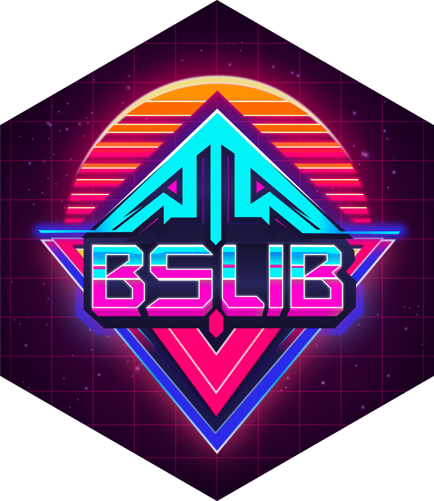
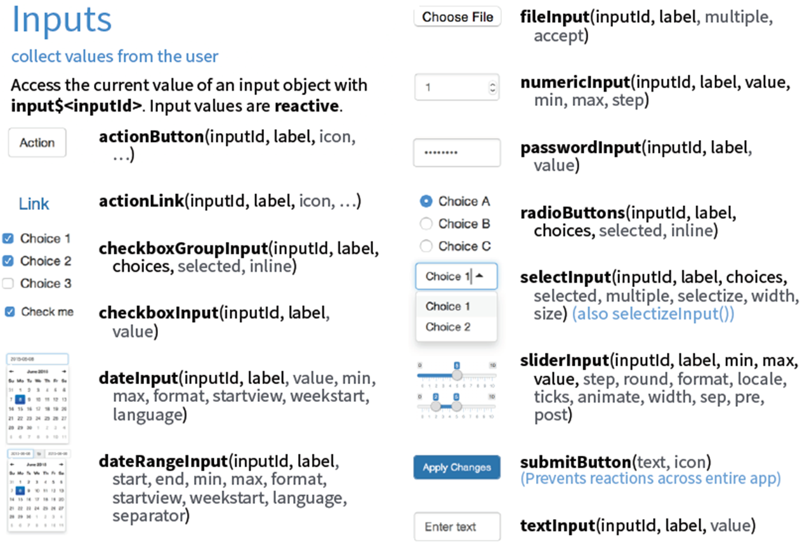
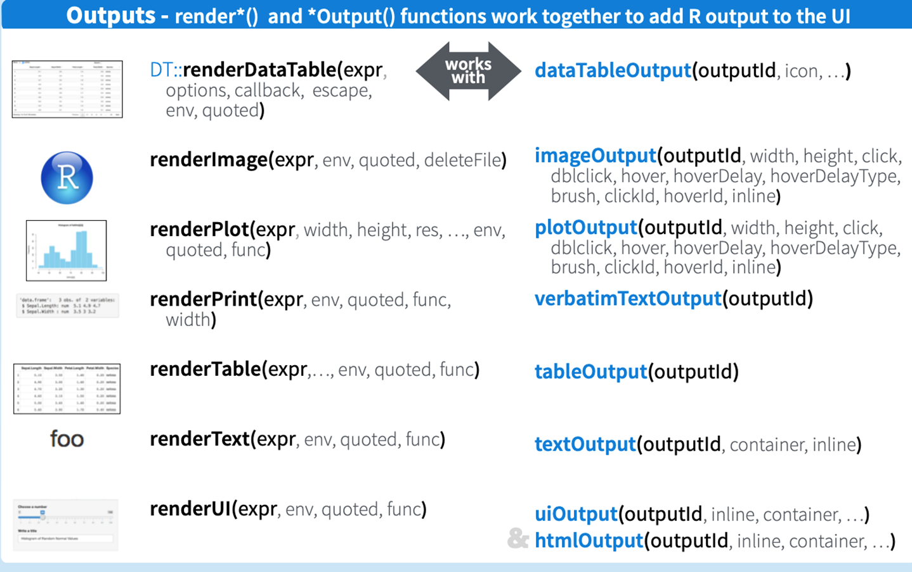

## 인터랙티브 웹 앱 구상 발표

-   일시

    -   2026년 1월 12일(월)

-   주제: 인구 관련

    -   저출산, 고령화, 인구 절벽, 지역 소멸, 학령 인구 감소 등

    -   인구 현상과 인문사회 콘텐츠 참고

-   데이터

    -   WPP 2024 혹은 KOSIS

-   발표 내용

    -   주제, 웹 앱 디자인(레이아웃 요소, 내용 요소, 상호작용 요소)

-   발표 방식

    -   5\~10분 정도의 프레젠테이션

## Shiny: (서버-기반) 웹 앱 개발 프레임워크

{style="font-size:1.25rem"}](images/hex_shiny.png)

## 리소스: Shiny 홈페이지

-   <https://shiny.posit.co/>

    -   Shiny for R(<https://shiny.posit.co/r/>)

    -   Shiny for Python(<https://shiny.posit.co/py/>)

-   11개 예시

    -   예시의 이름 검색: `runExample()`

        -   "01_hello", "02_text", "03_reactivity", "04_mpg", "05_sliders", "06_tabsets", "07_widgets", "08_html", "09_upload", "10_download", "11_timer"

    -   예시의 웹 앱 및 코드 보기: `runExample("01_hello", display = "showcase")`

## 리소스: 웹북

-   [Mastering Shiny](https://mastering-shiny.org/) by [Hadley Wickham](https://hadley.nz/)

-   [Outstanding User Interfaces with Shiny](https://unleash-shiny.rinterface.com/)

-   [Engineering Production-Grade Shiny Apps](https://engineering-shiny.org/)

-   [Interactive Web-Based Data Visualization with R, plotly, and shiny](https://plotly-r.com/)

-   [R Shiny Applications in Finance, Medicine Pharma and Education Industry](https://bookdown.org/loankimrobinson/rshinybook/)

-   [Introduction to Data Science: 25 Shiny Applications](https://bookdown.org/hneth/i2ds/shiny.html)

-   [데이터 사이언스를 위한 R 프로그래밍: 14 shiny](https://greendaygh.github.io/Rprog2021/shiny.html)

## 확장: bslib 패키지



## 기본 구조

-   ui 부분: 프론트엔드(front-end) 부분

    -   입력을 받고 출력을 표출하는 부분

-   server 부분: 백엔드(back-end) 부분

    -   받은 입력으로 출력을 산출하는 부분

-   결합: `shinyApp(ui = ui, server = server)`

{style="font-size:1.25rem"}](https://bookdown.org/hneth/i2ds/images/Shiny_ui_server.png)

## Shiny 프로젝트의 생성

-   New Project \> New Directory \> Shiny Application

{fig-align="center"}

## 웹 앱 예시

```{=html}
<iframe src="https://sangillee.shinyapps.io/AIEDU2025_Example//" loading="lazy" style="width: 100%; height: 900px; border: 0px none;" allow="web-share; clipboard-write"></iframe>
```

## 기본 구조: ui 부분

-   입력(input)

    -   '입력 함수': 사용자로부터 입력을 받아 '입력 객체'를 만드는 함수

    -   위젯(widget): ui를 위한 기본 시각 요소로, 미리 만들어져 있는 것

        -   버튼, 스크롤 바, 텍스트 상자, 체크박스, 라디오 버튼 등

    -   입력의 종류에 따라 다양: `*Input()`

        -   `sliderInput(inputID = "")`

-   출력(output)

    -   '출력 표출 함수': 서버로부터 '출력 객체'를 받아 디스플레이하는 함수

    -   출력의 종류에 따라 다양: `*Output()`

        -   `plotOutput(outputID = "")`

## 기본 구조: ui 부분

-   입력 함수(위젯): <https://shiny.posit.co/r/components/>



## 기본 구조: ui 부분

-   출력 함수: <https://shiny.posit.co/r/components/>

-   주요 함수: `*Output(outputID = "")`

    -   플롯: `plotOutput(outputID = "")`

    -   테이블: `tableOutput(outputID = "")`

    -   일반 텍스트: `textOutput(outputID = "")`

    -   사전 포맷된 텍스트: `verbatimeTextOutput(outputID = "")`

    -   이미지: `imageOutput(outputID = "")`

## 기본 구조: server 부분

-   입력 객체를 받아 특정한 출력 객체를 생성

    -   입력 객체: `input$inputID`

-   출력 객체 생성 함수(렌더링 함수): render\*({})

    -   `renderPlot({})`

    -   출력 객체: `output$outputID`

-   주요 함수: `render*()`

    -   플롯: `renderPlot()`

    -   테이블: `renderTable()`

    -   일반 텍스트: `renderText()`

    -   사전 포맷된 텍스트: `renderPrint()`

    -   이미지: `renderImage()`

## 기본 구조: ui-server 연계

-   출력 생성(렌더링) 함수와 출력 함수: <https://shiny.posit.co/r/components/>



## 기본 구조: ui-server 연계 {.smaller}

-   기본 출력 함수 쌍

| 형식 | 출력 표출 함수(UI) | 출력 생성(렌더링) 함수(Server) |
|----|----|----|
| 플롯 | `plotOutput(outputID = "")` | `renderPlot({})` |
| 테이블 | `tableOutput(outputID = "")` | `renderTable({})` |
| 일반 텍스트 | `textOutput(outputID = "")` | `renderText({})` |
| 사전 포맷된 텍스트 | `verbatimeTextOutput(outputID = "")` | `renderPrint({})` |
| 이미지 | `imageOutput(outputID = "")` | `renderImage({})` |

: {tbl-colwidths="\[24, 48, 28\]"}

## 기본 구조: ui-server 연계 {.smaller}

-   주요 패키지별 출력 함수 쌍

| 주요 패키지 | 출력 표출 함수(UI) | 출력 생성(렌더링) 함수(Server) |
|----|----|----|
| [**DT**](https://rstudio.github.io/DT/) | `DTOutput(outputID = "")` | `renderDT({})` |
| [**reactable**](https://glin.github.io/reactable/) | `reactableOutput(outputID = "")` | `renderReactable({})` |
| [**plotly**](https://plotly.com/r/) | `plotlyOutput(outputID = "")` | `renderPlotyl({})` |
| [**echarts4r**](https://echarts4r.john-coene.com/) | `echarts4rOutput(outputID = "")` | `renderEcharts4r({})` |
| [**leaflet**](https://rstudio.github.io/leaflet/) | `leafletOutput(outputID = "")` | `renderLeaflet({})` |
| [**tmap**](https://r-tmap.github.io/tmap/) | `tmapOutput(outputID = "")` | `renderTmap({})` |

## 반응성 함수 `reactive({})`

-   `render*()` 함수는 이미 반응성 함수

    -   사용자의 선택이 바뀔 때마다 갱신

-   반응성 함수 `reactive({})`

    -   입력 객체를 받아 '반응성 표현식(reactive expression)' 생성

    -   반응성 표현식: 단순히 최종 산출물(값이나 객체)만을 의미하지 않고, 그 산출물을 관리하는 메커니즘(종속성 추적, 지연 실행, 캐싱 등) 포함하는 동적인 객체

        -   반드시 함수 형태로 표기

    -   하나의 '입력 객체'가 다양한 '출력 객체(출력 생성 함수)'와 결부되는 경우

        -   동일한 입력 객체의 중복 사용 회피 목적

        -   해당 입력 객체를 반응성 표현식으로 전환

        -   다수의 출력 생성 함수에 입력 객체로 투입

## 웹 배포(deployment)

-   <https://www.shinyapps.io/>

-   계정 생성

    -   로그인 후 상단 오른쪽 끝 메뉴 "Tokens" 페이지로 이동

    -   페이지에서 Show를 통해 인증 토큰(Token)과 Secret 확보: Show secret를 클릭하여 secret까지 보이게 한 후 복사하기

-   RStudio에 토큰 설정

    -   R 콘솔에 복사한 내용 붙여넣기 및 실행

-   Publish 버튼 클릭

    -   스크립트 윈도우의 오른쪽 상단

    -   배포를 원하는 R 파일만 선택

-   URL 생성: https://userid.shinyapps.io/project_name/

    -   <https://sangillee.shinyapps.io/AIEDU2025_Example/>

## Quarto와 Shiny의 결합

-   상황: Quarto 대시보드의 일부 영역에서 Shiny 사용

-   두 가지 접근

    -   Shiny 중심 방식: Shiny 웹 앱의 생성

        -   Quarto 대시보드 내에서 Quarto 문법으로 Shiny 웹 앱 구축

        -   Quarto 대시보드 전체가 Shiny 웹 앱화: shinyapps.io를 통해 배포

        -   사례: <https://sangillee.shinyapps.io/Dashboard_Example/>

    -   Quarto 중심 방식: Quarto 대시보드의 유지

        -   Quarto 대시보드 속에 독립적으로 구축된 Shiny 웹 앱 임베딩

        -   여전히 Quarto 대시보드: Quarto Pub을 통해 배포

        -   사례: <https://sangillee.snu.ac.kr/dashboard_examples/>

## Quarto와 Shiny의 결합: Shiny 중심 방식

-   옵션 1: Quarto를 Shiny 웹 앱의 레이아웃 설정 도구로 사용

    -   **shiny** 패키지: `fluidPage()`

        -   `titlePanel()`, `SidebarLayout()`, `sidebarPanel()`, `mainPanel()`

    -   **bslib** 패키지: `page_sidebar()`

        -   `sidebar = sidebar()`, `card()`

-   옵션 2: Quarto 대시보드 내에서 Shiny 웹 앱 구축

## Quarto와 Shiny의 결합: Shiny 중심 방식

-   <https://quarto.org/docs/dashboards/interactivity/shiny-r.html>

-   YAML 헤더에 다음 첨가: `server: shiny`

-   ui 부분: 기본적으로는 `r` 코드 청크 속에 포함, 사이드바와 메인 병렬

    -   사이드바: 레이아웃 구성요소에 넣고 `{.sidebar}` CSS 클래스 지정 가능

    -   메인: 사이드바와 다른 레이아웃 구성요소에 넣기 가능

-   server 부분: `r` 코드 청크 속에 포함, 다음 지정

    -   `#| context: server` 지정

-   기타(패키지, 데이터 등) 부분: `r` 코드 청크 속에 포함, 다음 지정

    -   `#| context: setup`

    -   `#| include: false`

## Quarto와 Shiny의 결합: Quarto 중심 방식

-   보통 하나의 row에 임베딩

-   `src=""` 부분만 교체

```         
<iframe src="https://..." loading="lazy" style="width: 100%; height: 600px; border: 0px none;" allow="web-share; clipboard-write"></iframe>
```

## Chatbot 웹 앱

::: {layout-ncol="2"}
{style="font-size:1.25rem"}](images/hex_ellmer-02.png)

{style="font-size:1.25rem"}](images/hex_shinychat-01.png)
:::

## Chatbot 웹 앱

::: panel-tabset
## 코드

```{r}
#| echo: true
#| eval: false
library(shiny)
library(shinychat)
library(bslib)
library(ellmer)

ui <- page_fillable(
  chat_ui(
    id = "chat",
    messages = "your messages here"
  ),
  fillable_mobile = TRUE
)

server <- function(input, output, session) {
  chat <-
    chat_openai(
      base_url = "https://api.openai.com/v1",
      model = "gpt-5.1",
      api_key = your_api_key_here,
      system_prompt = ""
    )

  observeEvent(input$chat_user_input, {
    stream <- chat$stream_async(input$chat_user_input)
    chat_append("chat", stream)
  })
}

shinyApp(ui, server)
```

## 웹 앱

<iframe src="https://sangillee.shinyapps.io/my_shinychat/" loading="lazy" style="width: 100%; height: 600px; border: 0px none;" allow="web-share; clipboard-write">

</iframe>
:::
