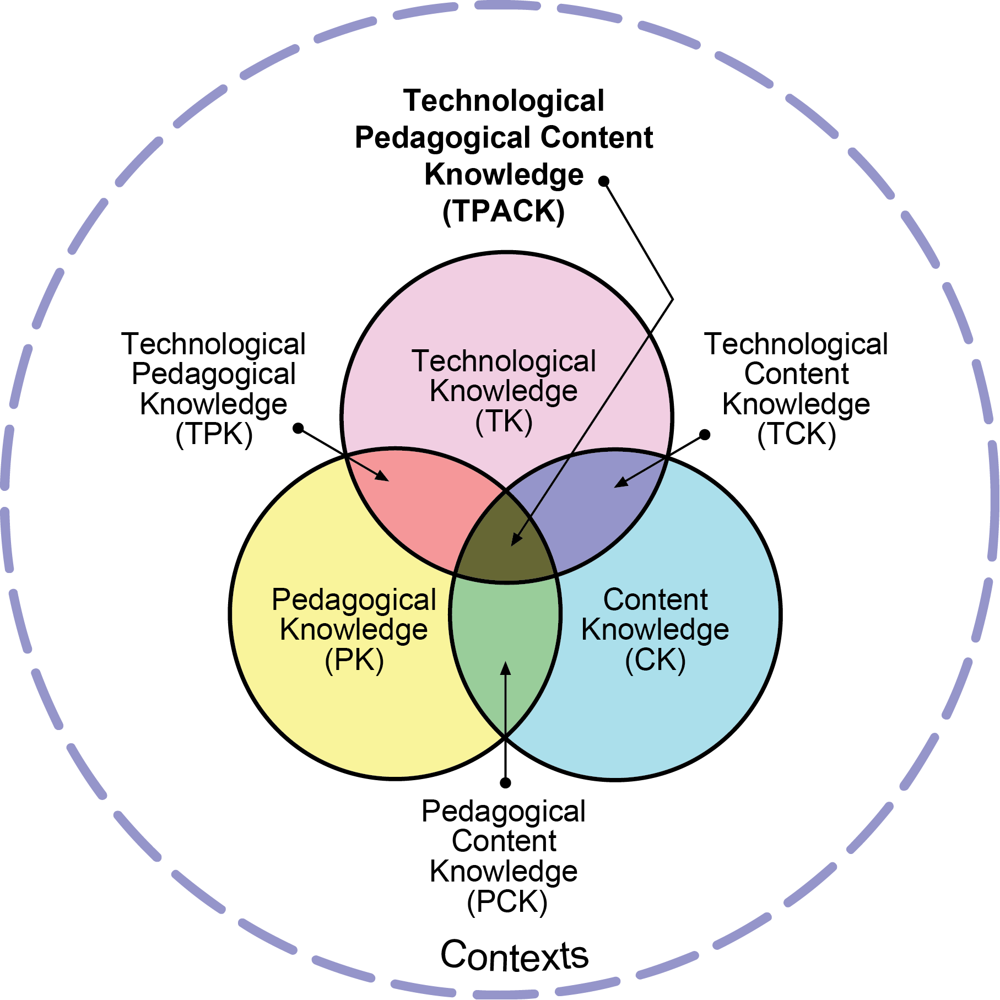
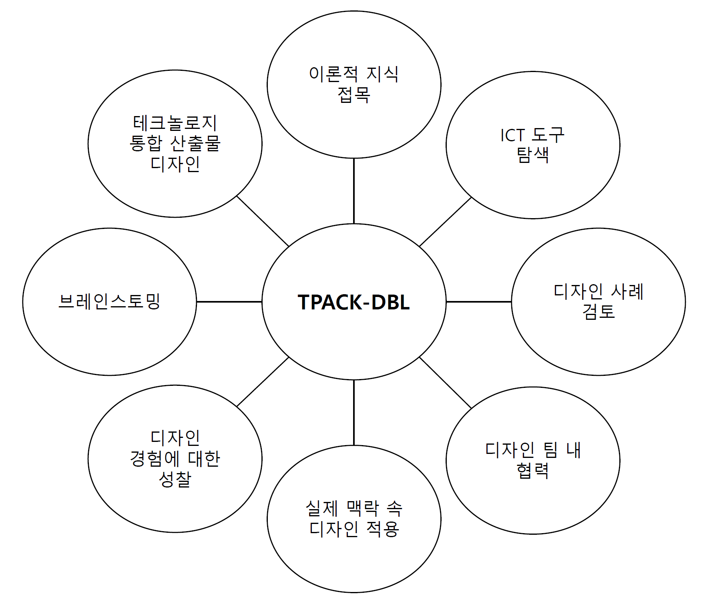

##  {.center}

::: {style="text-align: center; font-size:10rem; color:#e41a1c"}
재앙 vs. 축복
:::

##  {.center}

::: {style="text-align: center; font-size:10rem; color:#377eb8"}
펀더멘털   &   지속가능성
:::

##  {.center}

::: {style="text-align: center; font-size:10rem; color:#4daf4a"}
적임자
:::

## TPACK-DBL 프레임워크

::: {layout-ncol="2" layout-valign="center"}

:::

## 

{fig-align="center" height="950px"}

##  {.center}

::: {style="text-align: center; font-size:10rem; color:#984ea3"}
설문조사   [<https://forms.gle/B25nQbvBN8wuTC1a6>]{style="font-size:4rem"}
:::
